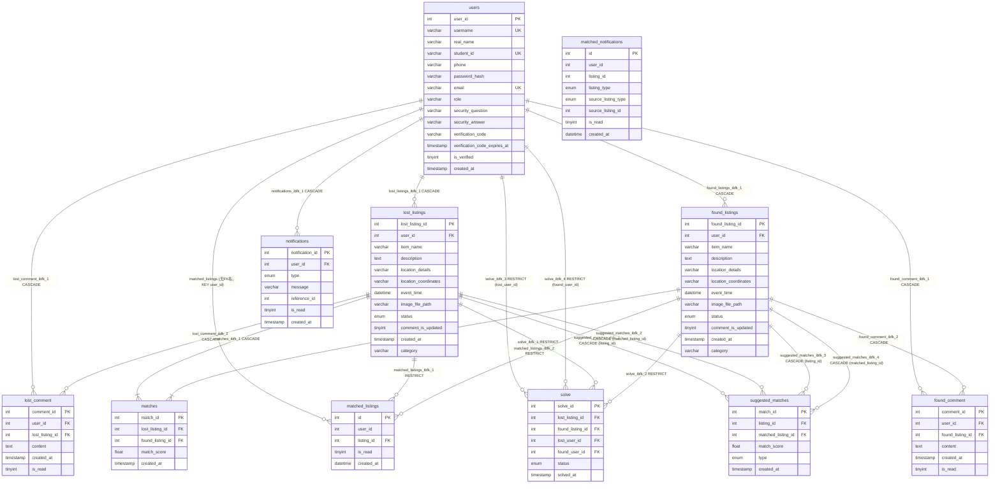

# DATABASE.md

> 完全基于 `DB_create.sql` 的真实逐字段解析，不包含任何猜测或虚构内容。

---

## 数据库基本信息

| 项 | 值 |
|---|---|
| 数据库名 | `lost_and_found` |
| 源 Dump 工具 | MySQL dump 10.13 Distrib 8.0.42 (Linux x86_64) |
| 源 Server 版本 | 8.0.42-0ubuntu0.22.04.1 |
| 当前运行版本 | MySQL 9.2.0 (Windows) |
| 字符集 | `utf8mb4` |
| 默认引擎 | `InnoDB` |
| 默认 Collate | `utf8mb4_0900_ai_ci` |
| 表数 | 11 |
| 创建顺序依赖解决 | 使用 `SET FOREIGN_KEY_CHECKS=0`（先建子表再建父表） |

---

## ER 关系图（基于 CREATE 中真实 FOREIGN KEY）



> 注意：`matched_notifications` 在 DB_create.sql 中**无任何 FOREIGN KEY**，仅有普通索引 `KEY user_id`。`matched_listings` 无对 users 的 FK，仅有 KEY user_id。

---

## 各表详细说明

---

### users（用户表）

- 用途：存储注册用户的基本账号信息、认证凭据、邮箱验证码。

#### 字段

| 字段名 | 类型 | NULL | 默认 | 说明/约束 |
|---|---|---|---|---|
| `user_id` | `int` | NOT NULL | AUTO_INCREMENT | 主键 |
| `username` | `varchar(50)` | NOT NULL | — | 用户名，**唯一键** |
| `real_name` | `varchar(50)` | YES | `NULL` | 姓名（正式需求「用户注册与登录」2026-09-05 新增） |
| `student_id` | `varchar(50)` | YES | `NULL` | 学号（正式需求新增；**唯一键**） |
| `phone` | `varchar(20)` | YES | `NULL` | 联系电话（正式需求新增；中国大陆手机/固话校验） |
| `password_hash` | `varchar(255)` | NOT NULL | — | `password_hash()` 结果哈希 |
| `email` | `varchar(100)` | NOT NULL | — | 邮箱，**唯一键** |
| `role` | `varchar(20)` | YES | `'user'` | 角色，非ENUM；实际用值 `'user'` / `'admin'` |
| `security_question` | `varchar(255)` | YES | `NULL` | 安全问题（找回密码用） |
| `security_answer` | `varchar(255)` | YES | `NULL` | 安全答案（找回密码用） |
| `verification_code` | `varchar(10)` | YES | `NULL` | 邮箱验证码 |
| `verification_code_expires_at` | `timestamp` | YES | `NULL` | 验证码过期时间 |
| `is_verified` | `tinyint(1)` | NOT NULL | `'0'` | 邮箱是否已验证标记；verify_email 验证成功后被 UPDATE 为 1；login.php 以该字段=1 作为放行登录条件之一 |
| `created_at` | `timestamp` | YES | `CURRENT_TIMESTAMP` | 创建时间 |

#### 主键
- `PRIMARY KEY (user_id)`

#### 唯一键
- `UNIQUE KEY username (username)`
- `UNIQUE KEY email (email)`
- `UNIQUE KEY student_id (student_id)`（正式需求新增）

#### 外键
- **无**（顶级父表）

#### 索引
- 主键 + 三个唯一键（InnoDB 自动建索引）

#### AUTO_INCREMENT 当前值
- `AUTO_INCREMENT=23`

#### 备注
- 无外键；是所有子表的父级表。
- `role` 字段是 `varchar(20)` 而非 ENUM，实际使用值为 `'user'` / `'admin'`。
- `real_name` / `student_id` / `phone` 三列为 2026-09-05 实现「功能1 用户注册与登录」时新增；对已有旧用户该三列允许为 NULL，新建用户在 register.php 中被校验必填。
- `is_verified` 字段：2026-09-05 起 login.php 以 `is_verified=1 AND verification_code IS NULL` 作为登录放行条件；verify_email.php 验证通过后 UPDATE `is_verified=1, verification_code=NULL, verification_code_expires_at=NULL`。
- **对已有数据库的迁移命令（不破坏数据，推荐执行）：**
  ```sql
  ALTER TABLE users
    ADD COLUMN real_name varchar(50) DEFAULT NULL COMMENT '姓名' AFTER username,
    ADD COLUMN student_id varchar(50) DEFAULT NULL COMMENT '学号' AFTER real_name,
    ADD COLUMN phone varchar(20) DEFAULT NULL COMMENT '联系电话' AFTER student_id,
    ADD UNIQUE KEY student_id (student_id);
  ```

---

### lost_listings（失物信息表）

- 用途：存储用户发布的丢失物品信息。

#### 字段

| 字段名 | 类型 | NULL | 默认 | 说明/约束 |
|---|---|---|---|---|
| `lost_listing_id` | `int` | NOT NULL | AUTO_INCREMENT | 主键 |
| `user_id` | `int` | NOT NULL | — | 发布者 user_id，FK → users |
| `item_name` | `varchar(100)` | NOT NULL | — | 物品名称 |
| `description` | `text` | YES | `NULL` | 物品描述 |
| `location_details` | `varchar(255)` | YES | `NULL` | 丢失地点文字描述 |
| `location_coordinates` | `varchar(100)` | YES | `NULL` | 坐标，格式如 `"lat,lng"` |
| `event_time` | `datetime` | YES | `NULL` | 丢失时间 |
| `image_file_path` | `varchar(255)` | YES | `NULL` | 图片相对/绝对路径 |
| `status` | `enum('pending','solved')` | NOT NULL | `'pending'` | 处理状态 |
| `comment_is_updated` | `tinyint(1)` | NOT NULL | `'0'` | 评论是否有更新的标记 |
| `created_at` | `timestamp` | YES | `CURRENT_TIMESTAMP` | 发布时间 |
| `category` | `varchar(50)` | NOT NULL | — | 物品分类 |

#### 主键
- `PRIMARY KEY (lost_listing_id)`

#### 唯一键
- **无**

#### 外键

| FK名 | 字段 → 父表(字段) | 行为 |
|---|---|---|
| `lost_listings_ibfk_1` | `user_id` → `users(user_id)` | `ON DELETE CASCADE` |

#### 索引
- `KEY user_id (user_id)`

#### AUTO_INCREMENT 当前值
- `AUTO_INCREMENT=132`

#### 备注
- `status` ENUM 允许值：`'pending'`（待解决，默认）、`'solved'`（已解决）
- 删除用户时级联删除其失物记录。
- `comment_is_updated`：源码中 publish_listing 插入时显式=0；后续 get_listings/detail 等 SELECT 未选此字段，用途**源码中未确认**。

---

### found_listings（招领/拾物信息表）

- 用途：存储用户发布的拾得物品招领信息。

#### 字段

| 字段名 | 类型 | NULL | 默认 | 说明/约束 |
|---|---|---|---|---|
| `found_listing_id` | `int` | NOT NULL | AUTO_INCREMENT | 主键 |
| `user_id` | `int` | NOT NULL | — | 发布者 user_id，FK → users |
| `item_name` | `varchar(100)` | NOT NULL | — | 物品名称 |
| `description` | `text` | YES | `NULL` | 物品描述 |
| `location_details` | `varchar(255)` | YES | `NULL` | 拾得地点文字描述 |
| `location_coordinates` | `varchar(100)` | YES | `NULL` | 坐标，格式如 `"lat,lng"` |
| `event_time` | `datetime` | YES | `NULL` | 拾得时间 |
| `image_file_path` | `varchar(255)` | YES | `NULL` | 图片路径 |
| `status` | `enum('unclaimed','claimed')` | NOT NULL | `'unclaimed'` | 认领状态 |
| `comment_is_updated` | `tinyint(1)` | NOT NULL | `'0'` | 评论是否有更新 |
| `created_at` | `timestamp` | YES | `CURRENT_TIMESTAMP` | 发布时间 |
| `category` | `varchar(50)` | NOT NULL | — | 物品分类 |

#### 主键
- `PRIMARY KEY (found_listing_id)`

#### 唯一键
- **无**

#### 外键

| FK名 | 字段 → 父表(字段) | 行为 |
|---|---|---|
| `found_listings_ibfk_1` | `user_id` → `users(user_id)` | `ON DELETE CASCADE` |

#### 索引
- `KEY user_id (user_id)`

#### AUTO_INCREMENT 当前值
- `AUTO_INCREMENT=72`

#### 备注
- 与 `lost_listings` **完全同构**，差异仅：
  - 主键名 `found_listing_id`（非 lost_listing_id）
  - `status` ENUM 取值：`'unclaimed'`（无人认领，默认）、`'claimed'`（已认领）
- 删除用户时级联删除其招领记录。

---

### lost_comment（失物评论表）

- 用途：存储用户在单条失物信息下的留言/评论。

#### 字段

| 字段名 | 类型 | NULL | 默认 | 说明/约束 |
|---|---|---|---|---|
| `comment_id` | `int` | NOT NULL | AUTO_INCREMENT | 主键 |
| `user_id` | `int` | NOT NULL | — | 评论者 user_id，FK → users |
| `lost_listing_id` | `int` | NOT NULL | — | 所属失物，FK → lost_listings |
| `content` | `text` | NOT NULL | — | 评论内容 |
| `created_at` | `timestamp` | YES | `CURRENT_TIMESTAMP` | 评论时间 |
| `is_read` | `tinyint(1)` | NOT NULL | `'0'` | 失主是否已读，默认0未读 |

#### 主键
- `PRIMARY KEY (comment_id)`

#### 唯一键
- **无**

#### 外键

| FK名 | 字段 → 父表(字段) | 行为 |
|---|---|---|
| `lost_comment_ibfk_1` | `user_id` → `users(user_id)` | `ON DELETE CASCADE` |
| `lost_comment_ibfk_2` | `lost_listing_id` → `lost_listings(lost_listing_id)` | `ON DELETE CASCADE` |

#### 索引
- `KEY user_id (user_id)`
- `KEY lost_listing_id (lost_listing_id)`

#### AUTO_INCREMENT 当前值
- `AUTO_INCREMENT=35`

#### 备注
- 两个 FK 均 CASCADE：删用户 → 删其评论；删失物 → 删其评论。
- `is_read` 默认为 0（未读），用于消息中心评论通知的已读标记。

---

### found_comment（招领评论表）

- 用途：存储用户在单条招领信息下的留言/评论。

#### 字段

| 字段名 | 类型 | NULL | 默认 | 说明/约束 |
|---|---|---|---|---|
| `comment_id` | `int` | NOT NULL | AUTO_INCREMENT | 主键 |
| `user_id` | `int` | NOT NULL | — | 评论者 user_id，FK → users |
| `found_listing_id` | `int` | NOT NULL | — | 所属招领，FK → found_listings |
| `content` | `text` | NOT NULL | — | 评论内容 |
| `created_at` | `timestamp` | YES | `CURRENT_TIMESTAMP` | 评论时间 |
| `is_read` | `tinyint(1)` | NOT NULL | `'0'` | 发布者是否已读，默认0 |

#### 主键
- `PRIMARY KEY (comment_id)`

#### 唯一键
- **无**

#### 外键

| FK名 | 字段 → 父表(字段) | 行为 |
|---|---|---|
| `found_comment_ibfk_1` | `user_id` → `users(user_id)` | `ON DELETE CASCADE` |
| `found_comment_ibfk_2` | `found_listing_id` → `found_listings(found_listing_id)` | `ON DELETE CASCADE` |

#### 索引
- `KEY user_id (user_id)`
- `KEY found_listing_id (found_listing_id)`

#### AUTO_INCREMENT 当前值
- `AUTO_INCREMENT=29`

#### 备注
- 与 `lost_comment` **同构**，差异仅 FK 指向 `found_listings.found_listing_id`。
- 两个 FK 均 CASCADE。

---

### matches（失物-招领匹配对表）

- 用途：存储失物与招领的匹配结果对及匹配分数。

#### 字段

| 字段名 | 类型 | NULL | 默认 | 说明/约束 |
|---|---|---|---|---|
| `match_id` | `int` | NOT NULL | AUTO_INCREMENT | 主键 |
| `lost_listing_id` | `int` | NOT NULL | — | FK → lost_listings |
| `found_listing_id` | `int` | NOT NULL | — | FK → found_listings |
| `match_score` | `float` | YES | `NULL` | 匹配分数（浮点） |
| `created_at` | `timestamp` | YES | `CURRENT_TIMESTAMP` | 创建时间 |

#### 主键
- `PRIMARY KEY (match_id)`

#### 唯一键
- `UNIQUE KEY lost_listing_id (lost_listing_id, found_listing_id)`（防止同一对重复匹配）

#### 外键

| FK名 | 字段 → 父表(字段) | 行为 |
|---|---|---|
| `matches_ibfk_1` | `lost_listing_id` → `lost_listings(lost_listing_id)` | `ON DELETE CASCADE` |
| `matches_ibfk_2` | `found_listing_id` → `found_listings(found_listing_id)` | `ON DELETE CASCADE` |

#### 索引
- `UNIQUE KEY lost_listing_id (lost_listing_id, found_listing_id)`
- `KEY found_listing_id (found_listing_id)`

#### AUTO_INCREMENT 当前值
- **未设置**（`ENGINE=InnoDB DEFAULT CHARSET=...` 中无 AUTO_INCREMENT 值）

#### 备注
- UNIQUE(lost_listing_id, found_listing_id) 复合唯一键。
- 当前匹配算法实现（`publish_secure.php` / `publish_listing.php` / `get_matched_listings.php` / `debug_notifications.php`）源码中**均未实际写入 matches 表**，仅写 `matched_notifications` 或 `suggested_matches`。该表**当前 API 未实际使用**。

---

### matched_listings（匹配记录关联表）

- 用途：存储用户与匹配物品的关联（源码中未确认主用途）。

#### 字段

| 字段名 | 类型 | NULL | 默认 | 说明/约束 |
|---|---|---|---|---|
| `id` | `int` | NOT NULL | AUTO_INCREMENT | 主键 |
| `user_id` | `int` | NOT NULL | — | 用户 user_id（仅有 KEY，无 FK） |
| `listing_id` | `int` | NOT NULL | — | 物品ID，同时FK到两张listings表 |
| `is_read` | `tinyint(1)` | YES | `'0'` | 是否已读 |
| `created_at` | `datetime` | YES | `CURRENT_TIMESTAMP` | 创建时间 |

#### 主键
- `PRIMARY KEY (id)`

#### 唯一键
- **无**

#### 外键

| FK名 | 字段 → 父表(字段) | 行为 |
|---|---|---|
| `matched_listings_ibfk_1` | `listing_id` → `lost_listings(lost_listing_id)` | 默认 `RESTRICT`（无 ON DELETE） |
| `matched_listings_ibfk_2` | `listing_id` → `found_listings(found_listing_id)` | 默认 `RESTRICT`（无 ON DELETE） |

#### 索引
- `KEY user_id (user_id)`（仅普通索引，非 FK）
- `KEY listing_id (listing_id)`

#### AUTO_INCREMENT 当前值
- `AUTO_INCREMENT=17`

#### 备注
- **特殊多 FK 现象**：同一字段 `listing_id` **同时** FK 到 `lost_listings.lost_listing_id` 和 `found_listings.found_listing_id` 两张表。理论上要求该 listing_id 值在两张表中均存在才能通过约束，但该结构源自生产 dump，说明可实际运行。
- `user_id` 仅有 `KEY user_id` 普通索引，**无 FK → users**。
- 实际使用：`confirm_delete.php` 事务中 `DELETE FROM matched_listings WHERE user_id=?` 删除清理；其余 API/前端页面**几乎未对该表做读写**，主流程使用 `matched_notifications`。该表**源码中未确认**主要用途，**当前 API 主流程未实际使用**。

---

### matched_notifications（匹配通知表）

- 用途：**当前匹配通知的主表**，用于用户匹配消息的存储与已读状态。

#### 字段

| 字段名 | 类型 | NULL | 默认 | 说明/约束 |
|---|---|---|---|---|
| `id` | `int` | NOT NULL | AUTO_INCREMENT | 主键 |
| `user_id` | `int` | NOT NULL | — | 接收通知的用户ID（仅有 KEY，无 FK） |
| `listing_id` | `int` | NOT NULL | — | 被匹配的本用户物品ID（无 FK） |
| `listing_type` | `enum('lost','found')` | NOT NULL | — | 本用户物品类型（失物/招领） |
| `source_listing_type` | `enum('lost','found')` | YES | `NULL` | 匹配来源物品类型 |
| `source_listing_id` | `int` | YES | `NULL` | 匹配来源物品ID |
| `type` | `enum('match','claim')` | NOT NULL | `'match'` | **消息类型区分**：`match` = 系统自动匹配通知（功能5 旧/新数据均使用此值）；`claim` = 认领申请通知（功能6 失主提交认领申请后，向招领主人写入，用于消息中心展示「您有新的认领申请」）。功能6 ALTER 新增列，DEFAULT 'match' 保证旧数据无需迁移。 |
| `is_read` | `tinyint(1)` | YES | `'0'` | 是否已读，默认0 |
| `created_at` | `datetime` | YES | `CURRENT_TIMESTAMP` | 通知创建时间 |

#### 主键
- `PRIMARY KEY (id)`

#### 唯一键
- **无**

#### 外键
- **无**（DB_create.sql 中无任何 FOREIGN KEY 定义）

#### 索引
- `KEY user_id (user_id)`（DB_create.sql 中仅定义此索引）
- `KEY idx_user_type (user_id, type)`（功能6 新增复合索引，加速 get_messages 按用户+类型筛选）

> 注：`database.php` 自动建表版本会额外加 `INDEX(listing_id)`，但 DB_create.sql 中未包含。

#### AUTO_INCREMENT 当前值
- `AUTO_INCREMENT=125`

#### 备注
- 该表是当前匹配通知的**主表**，被以下模块使用：
  - `get_messages.php`（匹配消息，`type="match"`）
  - `mark_message_read.php`（匹配消息类型）
  - `publish_listing.php` 发布时创建匹配通知
  - `get_matched_listings.php` 对已有匹配补建通知
  - `debug_notifications.php` 列表和修复
- **自动建表/修补字段（database.php）**：
  - 每次任何 API `require 'database.php'` 时执行 `ensure_matched_notifications_table_exists()`：
    1. `SHOW TABLES LIKE 'matched_notifications'`，若不存在则执行 `CREATE TABLE`（该 CREATE 中已含 `source_listing_id` / `source_listing_type`，且额外加了 `INDEX(listing_id)`）。
    2. 若表已存在但缺少 `source_listing_id` 或 `source_listing_type` 字段，则执行 `ALTER TABLE ... ADD COLUMN` 补字段。
  - 即 DB_create.sql 中该表字段已完整（含 source 两列），与自动建表版本字段一致，仅索引可能有微小差异。
- 无任何 FOREIGN KEY（对 users 仅有普通 KEY user_id）。

---

### notifications（通用通知表）

- 用途：通用系统通知表（new_match / new_comment 类型）。

#### 字段

| 字段名 | 类型 | NULL | 默认 | 说明/约束 |
|---|---|---|---|---|
| `notification_id` | `int` | NOT NULL | AUTO_INCREMENT | 主键 |
| `user_id` | `int` | NOT NULL | — | 接收通知的用户，FK → users |
| `type` | `enum('new_match','new_comment')` | NOT NULL | — | 通知类型 |
| `message` | `varchar(255)` | NOT NULL | — | 通知文字内容 |
| `reference_id` | `int` | NOT NULL | — | 关联的业务ID（match_id 或 comment_id） |
| `is_read` | `tinyint(1)` | NOT NULL | `'0'` | 是否已读，默认0 |
| `created_at` | `timestamp` | YES | `CURRENT_TIMESTAMP` | 通知创建时间 |

#### 主键
- `PRIMARY KEY (notification_id)`

#### 唯一键
- **无**

#### 外键

| FK名 | 字段 → 父表(字段) | 行为 |
|---|---|---|
| `notifications_ibfk_1` | `user_id` → `users(user_id)` | `ON DELETE CASCADE` |

#### 索引
- `KEY user_id (user_id)`

#### AUTO_INCREMENT 当前值
- **未设置**（无 AUTO_INCREMENT= 值）

#### 备注
- `type` ENUM 取值：`'new_match'`、`'new_comment'`。
- 结构规范，但在**当前源码实现中**：消息实际来自 `matched_notifications`（match 类型）+ `lost_comment`/`found_comment` 的 `is_read`（comment 类型），`notifications` 表**没有任何 API 对其进行读写**。该表**当前 API 未实际使用**。

---

### solve（认领解决/审核记录表）

- 用途：存储失物与招领的认领申请/审核流程记录。

#### 字段

| 字段名 | 类型 | NULL | 默认 | 说明/约束 |
|---|---|---|---|---|
| `solve_id` | `int` | NOT NULL | AUTO_INCREMENT | 主键 |
| `lost_listing_id` | `int` | NOT NULL | — | FK → lost_listings |
| `found_listing_id` | `int` | NOT NULL | — | FK → found_listings |
| `lost_user_id` | `int` | NOT NULL | — | 失主 user_id，FK → users |
| `found_user_id` | `int` | NOT NULL | — | 招领发布者 user_id，FK → users |
| `claim_features` | `varchar(500)` | NOT NULL | — | **认领申请三要素 1/3**：物品特征（必填，如颜色、编号、特殊标识等） |
| `lost_story` | `text` | NOT NULL | — | **认领申请三要素 2/3**：丢失经过（必填，详细描述丢失场景与过程） |
| `verification_info` | `text` | YES | `NULL` | **认领申请三要素 3/3**：其他验证信息（选填，如可公开的证件号后 4 位、购买截图描述等私密验证线索） |
| `created_at` | `timestamp` | NOT NULL | `CURRENT_TIMESTAMP` | 认领申请提交时间 |
| `updated_at` | `timestamp` | NOT NULL | `CURRENT_TIMESTAMP ON UPDATE CURRENT_TIMESTAMP` | 申请状态最后更新时间 |
| `status` | `enum('processing','completed')` | NOT NULL | `'processing'` | 处理状态 |
| `solved_at` | `timestamp` | YES | `CURRENT_TIMESTAMP` | 记录创建/解决时间 |

#### 主键
- `PRIMARY KEY (solve_id)`

#### 唯一键
- `UNIQUE KEY uk_lost_found_user (lost_listing_id, found_listing_id, lost_user_id)`：防止同一失主对同一对（失物+招领）重复提交申请，`submit_claim.php` 冲突返回 HTTP 409。

#### 外键

| FK名 | 字段 → 父表(字段) | 行为 |
|---|---|---|
| `solve_ibfk_1` | `lost_listing_id` → `lost_listings(lost_listing_id)` | 默认 `RESTRICT`（无 ON DELETE） |
| `solve_ibfk_2` | `found_listing_id` → `found_listings(found_listing_id)` | 默认 `RESTRICT`（无 ON DELETE） |
| `solve_ibfk_3` | `lost_user_id` → `users(user_id)` | 默认 `RESTRICT`（无 ON DELETE） |
| `solve_ibfk_4` | `found_user_id` → `users(user_id)` | 默认 `RESTRICT`（无 ON DELETE） |

#### 索引
- `KEY lost_listing_id (lost_listing_id)`
- `KEY found_listing_id (found_listing_id)`
- `KEY lost_user_id (lost_user_id)`
- `KEY found_user_id (found_user_id)`

#### AUTO_INCREMENT 当前值
- **未设置**

#### 备注
- `status` ENUM 取值：`'processing'`（处理中，默认 = 认领申请已提交，待招领主人在功能7 中审核通过/拒绝）、`'completed'`（已完成 = 认领审核通过，物品已归还失主）。
- **四个 FK 全部 RESTRICT**，这意味着在删除物品/用户前若有 solve 记录引用，删除会被阻止。这也是 `confirm_delete.php` 删除用户前必须先 `DELETE FROM solve ...` 清理关联记录的原因。
- **三要素文本字段（claim_features / lost_story / verification_info）已在功能6（认领申请）中启用，API 主流程中的 submit_claim.php 中写入；招领主人在 get_claims_for_my_found.php 中查看。
- **uk_lost_found_user 三列组合 UNIQUE 防止重复申请：同一失主对同一对失物+招领只允许提交 1 条 processing 申请。

---

### suggested_matches（建议匹配表）

- 用途：存储系统建议的匹配对及其匹配分数。

#### 字段

| 字段名 | 类型 | NULL | 默认 | 说明/约束 |
|---|---|---|---|---|
| `match_id` | `int` | NOT NULL | AUTO_INCREMENT | 主键 |
| `listing_id` | `int` | NOT NULL | — | 触发匹配的物品ID，同时FK到两张listings表 |
| `matched_listing_id` | `int` | NOT NULL | — | 被匹配到的物品ID，同时FK到两张listings表 |
| `match_score` | `float` | NOT NULL | — | 匹配分数（必填） |
| `type` | `enum('lost','found')` | NOT NULL | — | listing_id 的类型 |
| `created_at` | `timestamp` | YES | `CURRENT_TIMESTAMP` | 创建时间 |

#### 主键
- `PRIMARY KEY (match_id)`

#### 唯一键
- **无**

#### 外键

| FK名 | 字段 → 父表(字段) | 行为 |
|---|---|---|
| `suggested_matches_ibfk_1` | `listing_id` → `lost_listings(lost_listing_id)` | `ON DELETE CASCADE` |
| `suggested_matches_ibfk_2` | `matched_listing_id` → `lost_listings(lost_listing_id)` | `ON DELETE CASCADE` |
| `suggested_matches_ibfk_3` | `listing_id` → `found_listings(found_listing_id)` | `ON DELETE CASCADE` |
| `suggested_matches_ibfk_4` | `matched_listing_id` → `found_listings(found_listing_id)` | `ON DELETE CASCADE` |

#### 索引
- `KEY listing_id (listing_id)`
- `KEY matched_listing_id (matched_listing_id)`

#### AUTO_INCREMENT 当前值
- `AUTO_INCREMENT=19`

#### 备注
- **特殊多 FK 现象**：`listing_id` 和 `matched_listing_id` 两个字段**各自**同时 FK 到 `lost_listings` 和 `found_listings` 两张表（共 4 个 FK 约束）。同 `matched_listings`，理论上要求同一 ID 在两张 listings 表中均存在，但源自生产 dump，说明可运行。
- `match_score float NOT NULL`（必填，不同于 matches 表中为 NULL 允许）。
- `type` ENUM 取值：`'lost'`、`'found'`。
- 当前源码 API 和前端中**未发现对 suggested_matches 表的 INSERT/SELECT 操作**。该表**当前 API 未实际使用**。

---

## 表之间关系概述

### ON DELETE CASCADE 的表（删除父记录自动删子记录）

| 父表 | 子表 | FK |
|---|---|---|
| users | lost_listings | lost_listings_ibfk_1 |
| users | found_listings | found_listings_ibfk_1 |
| users | lost_comment | lost_comment_ibfk_1 |
| users | found_comment | found_comment_ibfk_1 |
| users | notifications | notifications_ibfk_1 |
| lost_listings | lost_comment | lost_comment_ibfk_2 |
| found_listings | found_comment | found_comment_ibfk_2 |
| lost_listings | matches | matches_ibfk_1 |
| found_listings | matches | matches_ibfk_2 |
| lost_listings | suggested_matches | suggested_matches_ibfk_1, _2 |
| found_listings | suggested_matches | suggested_matches_ibfk_3, _4 |

### ON DELETE RESTRICT（默认，删除会被阻止）

| 父表 | 子表 | FK |
|---|---|---|
| lost_listings | matched_listings | matched_listings_ibfk_1 |
| found_listings | matched_listings | matched_listings_ibfk_2 |
| lost_listings | solve | solve_ibfk_1 |
| found_listings | solve | solve_ibfk_2 |
| users | solve | solve_ibfk_3 (lost_user_id) |
| users | solve | solve_ibfk_4 (found_user_id) |

> 注意：matched_notifications 无任何 FK，matched_listings 的 user_id 无 FK，删除不会被这些表阻止。

### confirm_delete.php 删除用户顺序（与 RESTRICT 对应）

1. 先 `DELETE FROM solve WHERE lost_user_id=? OR found_user_id=?`（清理 RESTRICT 引用）
2. 再 `DELETE FROM matched_listings WHERE user_id=?`（清理普通记录；该表自身 FK 是 listing_id 指向 listings，不影响删 user_id）
3. 最后 `DELETE FROM users WHERE user_id=?`（此时级联 CASCADE：lost_listings / found_listings / lost_comment / found_comment / notifications 会被自动删除，连带它们的子级 matches / suggested_matches 也会 CASCADE）

---

## 特殊表/字段说明

### 1. users 特殊字段
- **`is_verified` 实际未使用**：登录逻辑未判断；verify_email.php 验证通过后仅清空 `verification_code` 和 `expires`，**未 UPDATE `is_verified=1`**。
- **`role` 是 varchar(20) 非 ENUM**：实际存值 `'user'` / `'admin'`。

### 2. comment_is_updated（lost_listings / found_listings）
- 源码中 publish_listing 插入时显式设为 0；get_listings / get_listing_details 等 SELECT 未取此字段。用途**源码中未确认**。

### 3. 各表当前 API 实际使用情况
| 表 | 主流程使用情况 |
|---|---|
| users | ✅ 使用 |
| lost_listings | ✅ 使用 |
| found_listings | ✅ 使用 |
| lost_comment | ✅ 使用 |
| found_comment | ✅ 使用 |
| matched_notifications | ✅ 使用（匹配通知主表） |
| matches | ❌ 当前 API 未实际使用（主流程未 INSERT/SELECT） |
| notifications | ❌ 当前 API 未实际使用（无读写） |
| matched_listings | ⚠️ 仅 confirm_delete 做 DELETE 清理；主流程读写均用 matched_notifications |
| solve | ❌ 当前 API 未实际使用（仅 confirm_delete 清理） |
| suggested_matches | ❌ 当前 API 未实际使用（无 INSERT/SELECT） |

### 4. matched_notifications 表的自动建表/修补字段
- `backend/config/database.php` 中每次加载都会执行 `ensure_matched_notifications_table_exists()`：
  - **DB_create.sql 不存在时创建**：自动 `CREATE TABLE`，该 SQL 已包含 `source_listing_id` / `source_listing_type` 字段，并加 `INDEX(listing_id)`。
  - **表已存在但缺字段时修补**：`SHOW COLUMNS` 检查 `source_listing_id` / `source_listing_type`，不存在则 `ALTER TABLE ... ADD COLUMN` 补加。
- 即第一次请求任何包含 database.php 的 API 时，会自动执行一次 SHOW TABLES / 可能的 ALTER。

### 5. matched_listings / suggested_matches 多 FK 指向两张 listings 表的现象
- 两张表均使用同一字段（如 `listing_id`）**同时** FOREIGN KEY 到 `lost_listings` 和 `found_listings`。
- MySQL InnoDB 允许多个 FK 同时指向不同父表，但插入时每个 FK 约束都必须满足（即该 listing_id 在两张父表中均存在）。
- 该 dump 源自生产环境，说明实际业务通过了这些约束（可能仅当两边都存在时才写入，或有其他处理逻辑）。

---

## ENUM 枚举值汇总

| 表 | 字段 | 允许值 | 默认 |
|---|---|---|---|
| lost_listings | `status` | `'pending'`, `'solved'` | `'pending'` |
| found_listings | `status` | `'unclaimed'`, `'claimed'` | `'unclaimed'` |
| matches | — | **无 ENUM 字段** | — |
| matched_notifications | `type` | `'match'`, `'claim'`, `'claim_approved'`, `'claim_rejected'` | `'match'` |
| matched_notifications | `listing_type` | `'lost'`, `'found'` | — (NOT NULL) |
| matched_notifications | `source_listing_type` | `'lost'`, `'found'` | `NULL` |
| notifications | `type` | `'new_match'`, `'new_comment'` | — (NOT NULL) |
| solve | `status` | `'processing'`, `'completed'`, `'rejected'` | `'processing'` |
| suggested_matches | `type` | `'lost'`, `'found'` | — (NOT NULL) |
| users | — | **无 ENUM 字段**（role 是 varchar） | — |
| lost_comment | — | 无 ENUM | — |
| found_comment | — | 无 ENUM | — |
| matched_listings | — | 无 ENUM | — |
