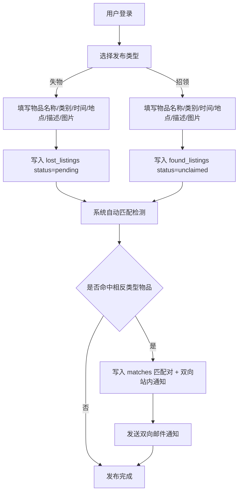
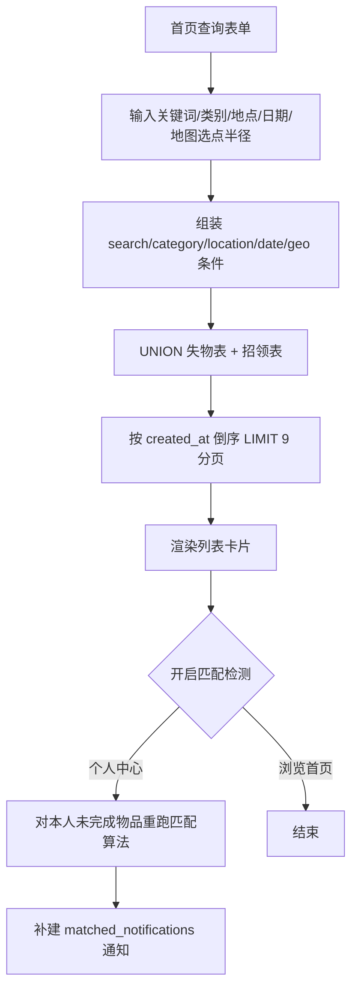
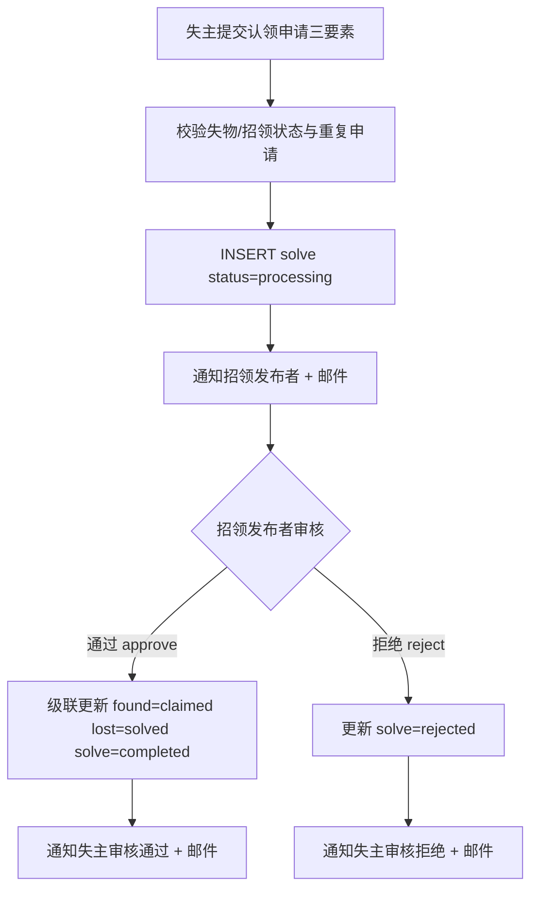
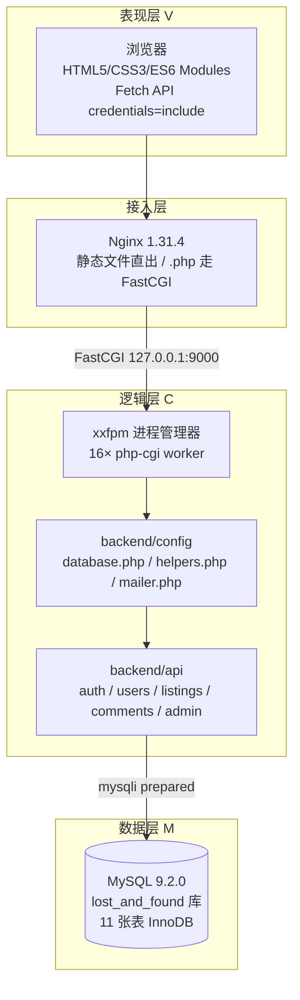
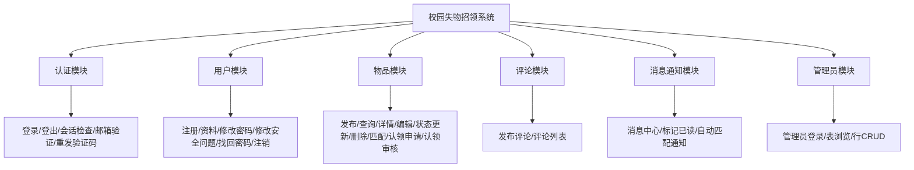
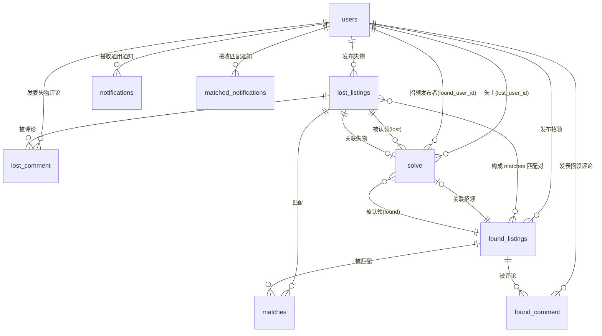
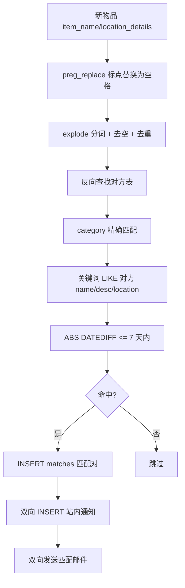
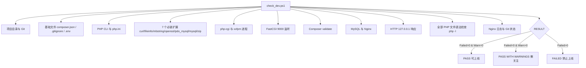

# 《管理信息系统》综合课程设计报告

**题目：基于 Web 的校园失物招领系统设计与实现**

| 项目        | 内容         |
| --------- | ---------- |
| **姓 名：**  | （此处填写姓名）   |
| **学 号：**  | （此处填写学号）   |
| **专 业：**  | （此处填写专业）   |
| **班 级：**  | （此处填写班级）   |
| **指导教师：** | （此处填写指导教师） |
| **职 称：**  | （此处填写职称）   |

**管理科学与工程学院**

**2026年9月**

***

# 《管理信息系统综合课程设计》评审表

> 此页装在封面与正文之间。

<table>
  <tr>
    <td rowspan="2">姓名</td>
    <td colspan="2" rowspan="2"></td>
    <td>学院</td>
    <td colspan="4">管理科学与工程学院</td>
    <td colspan="3">学 号</td>
    <td colspan="4"></td>
  </tr>
  <tr>
    <td colspan="3">专业班级</td>
    <td colspan="4"></td>
  </tr>
  <tr>
    <td>题目</td>
    <td colspan="14">基于 Web 的校园失物招领系统设计与实现</td>
  </tr>
  <tr>
    <td rowspan="9">评审意见</td>
    <td colspan="2" rowspan="2">项目</td>
    <td colspan="3" rowspan="2">具体要求</td>
    <td rowspan="2">单项分值</td>
    <td colspan="7">分项评分分数参考区间</td>
    <td rowspan="2">得分</td>
  </tr>
  <tr>
    <td colspan="2">A</td>
    <td>B</td>
    <td colspan="2">C</td>
    <td>D</td>
    <td>E</td>
  </tr>
  <tr>
    <td colspan="2">文献研究及工作量</td>
    <td colspan="3">熟练应用文献查阅工具，文献研究工作量饱满，积极展开分析讨论。</td>
    <td>10</td>
    <td colspan="2">9</td>
    <td>8</td>
    <td colspan="2">7</td>
    <td>6</td>
    <td>&lt;6</td>
    <td></td>
  </tr>
  <tr>
    <td colspan="2">解决方案质量</td>
    <td colspan="3">能根据任务要求，综合应用软件工程领域相关专业知识，分析和验证解决方案的合理性及准确性，并获得有效结论。文档符合规范和要求。分析思路正确、步骤完整，结论有效。系统设计等合理可行，规范性好。</td>
    <td>30</td>
    <td colspan="2">27</td>
    <td>24</td>
    <td colspan="2">21</td>
    <td>18</td>
    <td>&lt;18</td>
    <td></td>
  </tr>
  <tr>
    <td colspan="2">文档质量</td>
    <td colspan="3">文档规范，结构合理，文献工作量饱满，格式正确。</td>
    <td>10</td>
    <td colspan="2">9</td>
    <td>8</td>
    <td colspan="2">7</td>
    <td>6</td>
    <td>&lt;6</td>
    <td></td>
  </tr>
  <tr>
    <td colspan="2">代码实现</td>
    <td colspan="3">代码合理结构好，有创新意识。系统运行效果好，功能实现。按时完成团队分配的工作，工作量饱满，完成质量高。</td>
    <td>20</td>
    <td colspan="2">18</td>
    <td>16</td>
    <td colspan="2">14</td>
    <td>12</td>
    <td>&lt;12</td>
    <td></td>
  </tr>
  <tr>
    <td colspan="2">学习态度和团队工作表现</td>
    <td colspan="3">学习态度认真，积极与团队成员合作，积极参与讨论分析，团队关系融洽，能按时完成团队分配的工作。明确团队角色和分工，积极与团队成员合作，团队工作进展顺利。</td>
    <td>20</td>
    <td colspan="2">18</td>
    <td>16</td>
    <td colspan="2">14</td>
    <td>12</td>
    <td>&lt;12</td>
    <td></td>
  </tr>
  <tr>
    <td colspan="2">自我总结</td>
    <td colspan="3">心得收获内容翔实，自主学习相关方法、总结归纳相关技术的能力优秀。</td>
    <td>10</td>
    <td colspan="2">9</td>
    <td>8</td>
    <td colspan="2">7</td>
    <td>6</td>
    <td>&lt;6</td>
    <td></td>
  </tr>
  <tr>
    <td colspan="14">
      评审成绩：<br>
      □优秀（100-90） □良好（89-80） □中等（79-70） □及格（69-60） □不及格（&lt;60）
    </td>
  </tr>
  <tr>
    <td colspan="2">指导教师签名</td>
    <td colspan="2"></td>
    <td>职称</td>
    <td></td>
    <td colspan="3">时间</td>
    <td colspan="6">年 月 日</td>
  </tr>
</table>

***

# 目 录

```
1 引言........................................................................1
  1.1 选题背景与意义.......................................................1
  1.2 国内外研究现状.......................................................2
  1.3 系统目标与开发环境...................................................3
2 系统需求分析..............................................................5
  2.1 业务流程分析.........................................................5
    2.1.1 失物信息发布流程................................................5
    2.1.2 物品检索与匹配流程..............................................6
    2.1.3 认领申请与审核流程..............................................7
    2.1.4 通知推送流程....................................................8
  2.2 功能需求.............................................................9
    2.2.1 普通用户功能需求................................................9
    2.2.2 管理员功能需求..................................................11
  2.3 非功能需求...........................................................12
    2.3.1 安全性需求......................................................12
    2.3.2 性能与响应需求..................................................13
    2.3.3 可维护性与可扩展性需求..........................................13
3 系统总体设计.............................................................14
  3.1 系统架构设计.........................................................14
  3.2 功能模块设计.........................................................17
  3.3 数据库设计...........................................................19
    3.3.1 概念结构设计（E-R 模型）.......................................19
    3.3.2 逻辑结构设计（数据表结构）.....................................21
    3.3.3 数据库约束与外键设计..........................................27
4 系统详细设计与实现........................................................29
  4.1 后端核心接口设计.....................................................29
    4.1.1 统一响应与认证中间件...........................................29
    4.1.2 用户与认证模块接口.............................................31
    4.1.3 物品发布与查询接口.............................................33
    4.1.4 认领申请与审核接口.............................................35
    4.1.5 消息通知接口....................................................37
    4.1.6 管理员通用 CRUD 接口............................................39
  4.2 失物招领匹配算法设计.................................................40
  4.3 前端页面实现.........................................................42
    4.3.1 前端工程结构与统一封装.........................................42
    4.3.2 核心页面实现....................................................43
    4.3.3 地图功能集成....................................................46
  4.4 邮件通知与安全配置管理...............................................47
    4.4.1 PHPMailer 邮件集成.............................................47
    4.4.2 .env 环境变量隔离..............................................48
    4.4.3 密码安全与权限控制..............................................49
    4.4.4 图片上传与 XSS 防护.............................................50
5 系统测试与部署...........................................................52
  5.1 开发环境与自动化检测.................................................52
    5.1.1 环境检查脚本 check_dev.ps1.....................................52
    5.1.2 PHP 语法与依赖校验..............................................53
  5.2 API 测试.............................................................54
  5.3 功能测试用例.........................................................55
  5.4 系统部署.............................................................57
6 总结与展望...............................................................59
  6.1 项目总结.............................................................59
  6.2 技术难点与突破.......................................................59
  6.3 后续改进方向.........................................................60
参考文献....................................................................61
附录........................................................................62
```

***

# 课程设计题目

**基于 Web 的校园失物招领系统设计与实现**

***

# 1 引言

## 1.1 选题背景与意义

随着高等教育的普及与校园规模的不断扩大，学生在教室、图书馆、食堂、运动场等公共区域的物品遗失现象日益频繁。卡片、钥匙、雨伞、水杯、教材等物品丢失后往往难以找回，而拾得物品的学生通常不知道应通过何种渠道物归原主。传统的失物招领方式主要依赖张贴公告、口头询问或线下失物招领柜，这种模式信息传播范围小、更新不及时、缺乏统一管理，导致"失主找不到失物、拾主找不到失主"的信息断层问题十分突出。

校园失物招领系统正是为了破解这一痛点而设计。通过将失物发布、信息检索、智能匹配、认领核验和通知推送等环节进行信息化、流程化管理，系统能够显著提高失物归还效率：失主可以快速发布丢失物品的详情并检索潜在的拾获信息，拾主可以登记拾得物品等待失主认领，系统依据物品名称、类别、地点和时间等维度自动双向匹配，并以站内消息和邮件的方式主动推送线索。这不仅减少了重复搜寻的人力成本，也提升了校园管理的服务水平。

本课程设计题目为"题目七：基于 Web / 微信小程序的校园失物招领系统设计与实现"。经项目实际开发范围确认，本项目当前仅实现 Web 端（Browser + Nginx + PHP + MySQL），微信小程序端不在本次开发范围内。该系统采用管理信息系统常见的表现层、逻辑层、数据层三层结构，以 MVC 的开发模式进行架构与程序设计，覆盖了从需求分析、系统设计、编码调试到测试部署的完整软件工程流程。

## 1.2 国内外研究现状

失物招领系统的研究主要围绕信息共享与智能匹配两个方向展开。

在国外，一些高校与社区推行基于互联网的失物登记平台，将遗失物品与拾获物品统一录入共享数据库，供公众检索，其核心在于降低信息发布门槛与扩大检索覆盖面。与此同时，物联网与二维码技术被应用于物品标识追踪，通过为贵重物品粘贴唯一编码实现精确关联。

在国内，随着移动互联网与公众号、小程序的普及，失物招领业务逐步从线下公告转向线上平台。多数校园与城市公共服务机构上线了失物招领信息发布系统，支持按类别、地点、关键词检索。然而，早期系统普遍存在两个不足：一是检索多为单表静态查询，缺乏失物与招领之间的"自动双向匹配"能力；二是认领核验往往依赖线下人工确认，缺少结构化的认领申请与审核流程。

针对上述不足，本系统在设计上做了三方面改进：一是引入基于关键词分词、类别精确匹配与时间窗约束的失物—招领自动匹配算法；二是构建完整的认领申请三要素（物品特征、丢失经过、其他验证信息）与招领发布者审核闭环；三是打通站内消息通知与邮件通知双通道，使匹配线索和认领进展能够主动触达相关用户。

## 1.3 系统目标与开发环境

本系统的总体目标为：面向校园场景，为普通用户提供失物招领信息的"发布—检索—匹配—认领—通知"全流程服务，为管理员提供基于数据表的通用后台管理能力，并在保证易用性的同时兼顾安全性与可维护性。

系统的实际开发与运行环境如表1所示。

**表1 系统开发运行环境**

| 类别       | 组件                   | 版本 / 说明                                         |
| -------- | -------------------- | ----------------------------------------------- |
| 操作系统     | Windows              | 开发与部署平台                                         |
| Web 服务器  | Nginx                | 1.31.4，静态文件直接返回，`.php` 经 FastCGI 转发             |
| PHP 运行环境 | PHP                  | 8.3.12 NTS（Non Thread Safe），Visual C++ 2019 x64 |
| PHP 进程管理 | xxfpm                | 16 个 php-cgi worker，FastCGI 监听 127.0.0.1:9000   |
| 数据库      | MySQL                | 9.2.0，InnoDB 引擎，utf8mb4 字符集                     |
| 依赖管理     | Composer             | 2.10.3                                          |
| 前端技术     | HTML5 / CSS3 / 原生 JS | ES6 Modules，Fetch API，天地图 API v4                |
| 邮件服务     | PHPMailer            | 7.1，SMTP SMTPS SSL 465                          |
| 环境变量     | phpdotenv            | 5.7                                             |

系统入口网址为 `http://127.0.0.1/`，普通用户主页、登录、注册等页面位于 `frontend/` 目录，管理员后台位于 `frontend/admin/` 目录，所有后端接口位于 `backend/api/` 目录。

***

# 2 系统需求分析

## 2.1 业务流程分析

系统的主要参与者为普通用户（失主与拾主）和系统管理员。围绕"失物招领"这一核心业务，业务流程可归纳为失物信息发布、物品检索与匹配、认领申请与审核、通知推送四个主流程。

### 2.1.1 失物信息发布流程

用户注册登录后可发布两类信息：失物信息（我丢了物品）和招领信息（我拾到了物品）。发布时需填写物品名称、物品类别、事件时间、地点详情、物品描述，可上传图片并通过天地图标记经纬度坐标。系统根据发布类型将数据写入失物表或招领表，初始状态分别置为"待解决/无人认领"。

发布完成后，系统立即对该发布的物品执行匹配检测：与相反类型的已有物品按关键词与时间窗进行比对，命中后向相关用户发送站内通知与邮件。发布流程如图1所示。



图1 失物/招领信息发布流程图

### 2.1.2 物品检索与匹配流程

用户在首页可按多种条件组合查询物品，包括：类型过滤（失物/招领/全部）、关键词模糊搜索（匹配物品名称与描述）、物品类别精确匹配、地点模糊匹配、按经纬度与半径的地理范围检索以及按日期筛选，结果按时间倒序分页展示，每页 9 条。

信息匹配分两种触发时机：一是新发布时的即时匹配（见 2.1.1）；二是用户进入个人中心"匹配度较高的物品"分区时，系统对当前用户所有未完成物品重新执行匹配检测并补建缺失通知。匹配检索流程如图2所示。



图2 物品检索与匹配流程图

### 2.1.3 认领申请与审核流程

当失主在招领详情页看到可能与自己的失物匹配的招领信息时，可提交认领申请。申请需填写"认领三要素"：物品特征（必填）、丢失经过（必填）、其他验证信息（选填）。系统将申请写入认领记录表并置为"处理中"状态，同时向招领发布者发送站内申请通知与邮件。

招领发布者可查看收到的认领申请列表，根据失主提交的验证信息选择"通过"或"拒绝"。审核通过后，系统级联更新：招领状态置为"已认领"、失物状态置为"已解决"、认领记录置为"已完成"并记录解决时间，同时向失主发送审核通过通知与邮件。审核被拒绝时，认领记录置为"已拒绝"，并向失主发送拒绝通知。认领审核流程如图3所示。



图3 认领申请与审核流程图

### 2.1.4 通知推送流程

系统构建了"站内消息 + 邮件"双通道的消息通知体系。站内消息存储在匹配通知表与评论表中，邮件通过 PHPMailer 发送。系统覆盖的关键通知事件如表2所示。

**表2 系统通知事件清单**

| 事件类型    | 站内消息类型           | 邮件触发 | 触发场景          |
| ------- | ---------------- | ---- | ------------- |
| 匹配通知    | `match`          | 是    | 新发布物品命中相反类型物品 |
| 认领申请通知  | `claim`          | 是    | 失主提交认领申请      |
| 认领审核通过  | `claim_approved` | 是    | 招领发布者审核通过     |
| 认领审核拒绝  | `claim_rejected` | 是    | 招领发布者审核拒绝     |
| 评论通知    | `comment`        | 是    | 其他用户评论了我的物品   |
| 注册验证码   | —                | 是    | 新用户注册         |
| 重发验证码   | —                | 是    | 用户重发注册验证码     |
| 找回密码验证码 | —                | 是    | 忘记密码第一步       |
| 注销验证码   | —                | 是    | 用户申请注销账户      |

站内消息在用户进入"消息中心"后按类型分区展示，并有未读标记与顶部红色数字徽章（导航栏每 45 秒轮询刷新），点击后跳转详情并标记已读。邮件发送采用"失败隔离"策略：邮件发送失败仅记录日志，不影响主业务事务的提交，从而保证业务状态一致性与邮件可用的解耦。

## 2.2 功能需求

### 2.2.1 普通用户功能需求

依据课程设计正式需求基线，普通用户端的核心功能需求如表3所示。

**表3 普通用户功能需求清单**

| 编号  | 功能      | 需求说明                                  | 实现要点                                                           |
| --- | ------- | ------------------------------------- | -------------------------------------------------------------- |
| F1  | 用户注册与登录 | 注册填写姓名、学号、联系电话、邮箱、密码与安全问题；登录后可发布失物或招领 | 邮箱 6 位验证码激活，`is_verified=1` 才放行登录；Session 会话管理；返回 role 支撑权限判断  |
| F2  | 失物信息发布  | 填写物品名称、类别、丢失时间、丢失地点、物品特征、图片           | `publish_secure.php`，支持图片上传与地图坐标                               |
| F3  | 招领信息发布  | 填写拾取时间、拾取地点、物品类别、描述、图片                | 与失物发布共用接口，通过 `listing_type=found` 区分                           |
| F4  | 信息查询    | 按名称/类别/地点/发布时间查询，支持模糊查询与多条件组合         | `get_listings.php` 的 search/category/location/date/geo/sort 组合 |
| F5  | 信息匹配    | 依据名称、类别、地点、时间对失物与招领自动匹配并展示            | 关键词分词 + 类别精确 + 时间窗 ±7 天匹配算法                                    |
| F6  | 认领申请    | 失主对招领信息提交认领申请，填写验证信息                  | `submit_claim.php`，事务 + 行锁 + 防重复提交（409）                        |
| F7  | 认领审核    | 招领发布者查看申请并按验证信息通过或拒绝                  | `review_claim.php`，事务 + 级联更新，非本人 403                           |
| F8  | 个人中心    | 查看我的失物、我的招领、认领记录，可编辑/删除未完成信息          | `profile.html`，六项统计卡 + 四类分区                                    |
| F9  | 消息通知    | 认领申请提交、审核通过与拒绝后向相关用户发送提醒              | 站内消息中心 + 邮件双通道                                                 |
| F10 | 资料与账户管理 | 修改资料、修改密码、修改安全问题、找回密码、注销账户            | `user_info.html`，强制重登策略                                        |

### 2.2.2 管理员功能需求

管理员功能包括独立登录后台与通用数据表管理，具体需求如表4所示。

**表4 管理员功能需求清单**

| 编号 | 功能    | 需求说明                             |
| -- | ----- | -------------------------------- |
| A1 | 管理员登录 | 校验用户角色为 `admin` 后方可登录，独立会话键，独立登出 |
| A2 | 数据表浏览 | 列出 `lost_and_found` 数据库全部 11 张表  |
| A3 | 表数据查询 | 查看任意表的字段与记录，返回主键列名               |
| A4 | 数据行修改 | 按主键更新任意行，受表名白名单、列名白名单与敏感列黑名单约束   |
| A5 | 数据行删除 | 按主键删除任意行，校验主键真实性，禁止删除当前登录管理员自身   |

系统管理员可以对用户发布的信息进行审核，删除虚假或违规内容，管理物品分类与用户账号。管理员功能全部采用数据库表级 CRUD 的通用实现，通过表名白名单与列名白名单在服务端完成权限校验，避免 SQL 注入。审核违规信息、分类管理、禁用用户等业务级操作可通过通用 CRUD 在 `users`、`lost_listings`、`found_listings` 三张表内手动完成。

## 2.3 非功能需求

### 2.3.1 安全性需求

系统在数据库访问、认证、配置与文件上传等多个层面落实安全要求：

- 数据库访问使用 `mysqli` 预处理语句（prepared statements），通过 `bind_param` 绑定参数，禁止拼接用户输入构成 SQL；
- 密码使用 `password_hash()` 存储哈希、`password_verify()` 验证，不保存明文；
- 会话使用 `httponly` + `use_only_cookies`，登录后执行 `session_regenerate_id(true)` 防会话固定，管理员与普通用户使用两套独立会话键；
- 数据库连接信息、SMTP 授权码等敏感凭据通过 `.env` 环境变量隔离，`.env` 不提交 Git；
- 图片上传执行扩展名白名单 + `finfo` 真实 MIME 检测 + 扩展名与内容一致性三重校验；
- 管理员接口在服务端校验 `role=admin`，数据库操作辅以表名/列名白名单与敏感字段黑名单。

### 2.3.2 性能与响应需求

系统基于 Nginx + xxfpm 多 worker 架构运行，`xxfpm -n 16` 启动 16 个 php-cgi 进程并行处理请求，具备基本并发处理能力。列表接口按页加载（每页 9 条）控制单次响应规模；常用外键字段（`user_id`、`listing_id`）建立索引，匹配通知表建立 `(user_id, type)` 复合索引以加速按用户和类型的消息查询。地理检索采用 Haversine 公式在 SQL 中进行半径过滤，避免将全部数据载入内存。

### 2.3.3 可维护性与可扩展性需求

系统采用表现层、逻辑层、数据层三层分离，前端为多个 ES6 模块页面对应独立后端接口，接口通过统一 `api/index.js` 封装，耦合度低便于维护。后端配置文件（`database.php`、`helpers.php`、`mailer.php`）集中管理数据库连接、统一响应与邮件发送，公共逻辑复用。匹配通知表提供自动建表与字段修补逻辑（`ensure_matched_notifications_table_exists()`），降低部署迁移成本。配套提供环境检查脚本 `check_dev.ps1`、API 文档、数据库文档与测试文档，便于后续升级与扩展。

***

# 3 系统总体设计

## 3.1 系统架构设计

系统采用 B/S（Browser/Server）结构与表现层、逻辑层、数据层的三层架构，并按 MVC 思想组织代码：HTML/CSS/JS 作为视图（View），PHP 接口中的业务控制逻辑作为控制器（Controller），MySQL 数据表及 mysqli 数据访问作为模型（Model）。整体架构如图4所示。



图4 系统总体架构图

架构共分四个层次：

- **表现层（View）**：前端采用原生 HTML5/CSS3 与 ES6 Modules，页面逻辑与页面模板分离，工具函数（DOM 操作、XSS 转义、地图）独立封装。所有数据交互通过 Fetch API 完成，统一设置 `credentials: 'include'` 携带会话 Cookie，HTTP 401 时自动跳转登录页。
- **接入层**：Nginx 直接返回静态资源，对 `.php` 请求经 FastCGI 协议转发到 `127.0.0.1:9000`。
- **逻辑层（Controller）**：xxfpm 管理 16 个 php-cgi worker 常驻进程池，实际执行各模块 PHP 接口；配置层负责数据库连接、统一 JSON 响应、登录/权限校验与邮件发送。
- **数据层（Model）**：MySQL 9.2.0 存储全部业务数据，InnoDB 引擎支持外键与事务，utf8mb4 字符集支持中文。

系统内部的数据访问模式是"前端直接访问具体 API 物理文件"。虽然项目保留了顶层路由入口 `backend/api/index.php`，但其依赖的若干子模块 include 文件并不存在，故生产调用一律使用形如 `/backend/api/auth/login.php` 的具体文件路径。

后端配置层承担了"中间件"角色，其关键职责如表5所示。

**表5 后端公共配置职责**

| 配置文件           | 关键功能                                                                                                                                           |
| -------------- | ---------------------------------------------------------------------------------------------------------------------------------------------- |
| `database.php` | 加载 `.env`，获取 mysqli 连接并 `set_charset("utf8mb4")`，提供统一 JSON 响应，自动建表/补字段                                                                         |
| `helpers.php`  | `sendResponse()` 统一响应；`requireLogin()` / `isLoggedIn()` / `getCurrentUserId()` 认证中间件；`validateOwnership()` 所有权校验；`require_admin_login()` 管理员校验 |
| `mailer.php`   | `send_notification_email()` 封装 PHPMailer，SMTP SMTPS SSL 465，UTF-8 与 HTML 邮件，失败仅记日志                                                             |

## 3.2 功能模块设计

系统按业务职责划分为六个功能模块，如图5所示。



图5 系统功能模块图

各模块对应的后端接口目录为：认证模块 `backend/api/auth/`、用户模块 `backend/api/users/`、物品模块 `backend/api/listings/`、评论模块 `backend/api/comments/`、管理员模块 `backend/api/admin/`。其中物品模块承担了最主要的业务逻辑（发布、查询、匹配、认领、审核）。

## 3.3 数据库设计

### 3.3.1 概念结构设计（E-R 模型）

数据库命名为 `lost_and_found`，共 11 张表：`users`、`lost_listings`、`found_listings`、`lost_comment`、`found_comment`、`matches`、`matched_listings`、`matched_notifications`、`notifications`、`suggested_matches`、`solve`。各表间的实体关系如图6所示。



图6 系统 E-R 关系图

其中 `users` 是整个系统的父表；`lost_listings` 与 `found_listings` 为两大主体业务表；`solve` 表记录失物与招领之间的认领申请与审核状态，是连接双主体的桥接表；`matched_notifications` 是匹配与认领通知的主存储表；`matches`、`suggested_matches`、`matched_listings` 为匹配关系的辅助表。

### 3.3.2 逻辑结构设计（数据表结构）

以下依据 `DB_create.sql` 中的真实字段定义列出各主要数据表的结构。

**users（用户表）**

**表6 users 表结构**

| 字段名                            | 类型           | 允许NULL | 说明/约束                                 |
| ------------------------------ | ------------ | ------ | ------------------------------------- |
| `user_id`                      | int          | 否      | 主键，自增                                 |
| `username`                     | varchar(50)  | 否      | 用户名，唯一键                               |
| `real_name`                    | varchar(50)  | 是      | 姓名                                    |
| `student_id`                   | varchar(50)  | 是      | 学号，唯一键                                |
| `phone`                        | varchar(20)  | 是      | 联系电话                                  |
| `password_hash`                | varchar(255) | 否      | `password_hash()` 哈希结果                |
| `email`                        | varchar(100) | 否      | 邮箱，唯一键                                |
| `role`                         | varchar(20)  | 是      | 角色，默认 `'user'`，实际值 `'user'`/`'admin'` |
| `security_question`            | varchar(255) | 是      | 安全问题                                  |
| `security_answer`              | varchar(255) | 是      | 安全答案（哈希存储）                            |
| `verification_code`            | varchar(10)  | 是      | 邮箱验证码                                 |
| `verification_code_expires_at` | timestamp    | 是      | 验证码过期时间                               |
| `is_verified`                  | tinyint(1)   | 否      | 邮箱是否验证，默认 `0`                         |
| `created_at`                   | timestamp    | 是      | 注册时间                                  |

`users` 无外键，是子表的父级表。唯一键包括 `username`、`email`、`student_id`。

**lost\_listings（失物信息表）**

**表7 lost\_listings 表结构**

| 字段名                    | 类型                       | 允许NULL | 说明/约束             |
| ---------------------- | ------------------------ | ------ | ----------------- |
| `lost_listing_id`      | int                      | 否      | 主键，自增             |
| `user_id`              | int                      | 否      | 发布者，外键 → users    |
| `item_name`            | varchar(100)             | 否      | 物品名称              |
| `description`          | text                     | 是      | 物品描述              |
| `location_details`     | varchar(255)             | 是      | 丢失地点文字描述          |
| `location_coordinates` | varchar(100)             | 是      | 坐标，格式 `"lng,lat"` |
| `event_time`           | datetime                 | 是      | 丢失时间              |
| `image_file_path`      | varchar(255)             | 是      | 图片路径              |
| `status`               | enum('pending','solved') | 否      | 状态，默认 `pending`   |
| `comment_is_updated`   | tinyint(1)               | 否      | 评论更新标记，默认 `0`     |
| `created_at`           | timestamp                | 是      | 发布时间              |
| `category`             | varchar(50)              | 否      | 物品分类              |

外键：`user_id → users(user_id)`，`ON DELETE CASCADE`。

**found\_listings（招领信息表）**

**表8 found\_listings 表结构**

| 字段名                    | 类型                          | 允许NULL | 说明/约束             |
| ---------------------- | --------------------------- | ------ | ----------------- |
| `found_listing_id`     | int                         | 否      | 主键，自增             |
| `user_id`              | int                         | 否      | 发布者，外键 → users    |
| `item_name`            | varchar(100)                | 否      | 物品名称              |
| `description`          | text                        | 是      | 物品描述              |
| `location_details`     | varchar(255)                | 是      | 拾得地点文字描述          |
| `location_coordinates` | varchar(100)                | 是      | 坐标，格式 `"lng,lat"` |
| `event_time`           | datetime                    | 是      | 拾得时间              |
| `image_file_path`      | varchar(255)                | 是      | 图片路径              |
| `status`               | enum('unclaimed','claimed') | 否      | 状态，默认 `unclaimed` |
| `comment_is_updated`   | tinyint(1)                  | 否      | 评论更新标记，默认 `0`     |
| `created_at`           | timestamp                   | 是      | 发布时间              |
| `category`             | varchar(50)                 | 否      | 物品分类              |

外键：`user_id → users(user_id)`，`ON DELETE CASCADE`。其结构除主键名与状态枚举外，与 `lost_listings` 完全同构。

**lost\_comment（失物评论表）**

**表9 lost\_comment 表结构**

| 字段名               | 类型         | 允许NULL | 说明/约束                    |
| ----------------- | ---------- | ------ | ------------------------ |
| `comment_id`      | int        | 否      | 主键，自增                    |
| `user_id`         | int        | 否      | 评论者，外键 → users           |
| `lost_listing_id` | int        | 否      | 所属失物，外键 → lost\_listings |
| `content`         | text       | 否      | 评论内容                     |
| `created_at`      | timestamp  | 是      | 评论时间                     |
| `is_read`         | tinyint(1) | 否      | 失主是否已读，默认 `0`            |

外键均 `ON DELETE CASCADE`。

**found\_comment（招领评论表）**

结构与 `lost_comment` 同构，区别在于外键指向 `found_listings(found_listing_id)`。

**matches（失物—招领匹配对表）**

**表10 matches 表结构**

| 字段名                | 类型        | 允许NULL | 说明/约束                   |
| ------------------ | --------- | ------ | ----------------------- |
| `match_id`         | int       | 否      | 主键，自增                   |
| `lost_listing_id`  | int       | 否      | 失物，外键 → lost\_listings  |
| `found_listing_id` | int       | 否      | 招领，外键 → found\_listings |
| `match_score`      | float     | 是      | 匹配分数                    |
| `created_at`       | timestamp | 是      | 匹配时间                    |

复合唯一键：`(lost_listing_id, found_listing_id)`，防止重复匹配。

**matched\_notifications（匹配通知表）**

**表11 matched\_notifications 表结构**

| 字段名                   | 类型                                                        | 允许NULL | 说明/约束           |
| --------------------- | --------------------------------------------------------- | ------ | --------------- |
| `id`                  | int                                                       | 否      | 主键，自增           |
| `user_id`             | int                                                       | 否      | 接收通知的用户         |
| `listing_id`          | int                                                       | 否      | 本用户物品ID         |
| `listing_type`        | enum('lost','found')                                      | 否      | 本用户物品类型         |
| `source_listing_type` | enum('lost','found')                                      | 是      | 匹配来源物品类型        |
| `source_listing_id`   | int                                                       | 是      | 匹配来源物品ID        |
| `type`                | enum('match','claim','claim\_approved','claim\_rejected') | 否      | 消息类型，默认 `match` |
| `is_read`             | tinyint(1)                                                | 是      | 是否已读，默认 `0`     |
| `created_at`          | datetime                                                  | 是      | 创建时间            |

索引：`KEY user_id`、`KEY idx_user_type (user_id, type)`。该表无外键，是当前匹配与认领通知的主存储表；`type` 字段将站内消息划分为匹配通知、认领申请、审核通过、审核拒绝四类。

**solve（认领解决表）**

**表12 solve 表结构**

| 字段名                 | 类型                                        | 允许NULL | 说明/约束                   |
| ------------------- | ----------------------------------------- | ------ | ----------------------- |
| `solve_id`          | int                                       | 否      | 主键，自增                   |
| `lost_listing_id`   | int                                       | 否      | 失物，外键 → lost\_listings  |
| `found_listing_id`  | int                                       | 否      | 招领，外键 → found\_listings |
| `lost_user_id`      | int                                       | 否      | 失主，外键 → users           |
| `found_user_id`     | int                                       | 否      | 招领发布者，外键 → users        |
| `claim_features`    | varchar(500)                              | 否      | 认领三要素1：物品特征             |
| `lost_story`        | text                                      | 否      | 认领三要素2：丢失经过             |
| `verification_info` | text                                      | 是      | 认领三要素3：其他验证信息           |
| `created_at`        | timestamp                                 | 否      | 申请提交时间                  |
| `updated_at`        | timestamp                                 | 否      | 状态更新时间                  |
| `status`            | enum('processing','completed','rejected') | 否      | 状态，默认 `processing`      |
| `solved_at`         | timestamp                                 | 是      | 解决/创建时间                 |

复合唯一键：`uk_lost_found_user (lost_listing_id, found_listing_id, lost_user_id)`，防止同一失主对同一匹配对重复提交申请。四个外键均无级联删除（默认 RESTRICT），因此删除用户或物品前必须先清理对应认领记录。

其余辅助表包括：`notifications`（通用通知表，类型 `new_match`/`new_comment`）、`matched_listings`（用户匹配关联表）、`suggested_matches`（建议匹配表）。

### 3.3.3 数据库约束与外键设计

系统充分运用外键保证数据一致性，级联删除与受限删除策略如下：

- **级联删除（CASCADE）**：删除用户时自动删除其发布的失物、招领、评论与通用通知；删除失物/招领时自动删除其评论与匹配记录。这样避免孤儿数据。
- **受限删除（RESTRICT）**：`solve` 表与 `matched_listings` 表的部分外键采用默认 RESTRICT，存在认领记录或匹配关联时禁止直接删除父记录。因此注销账户时，系统在事务中先删除 `solve`（按失主/招领发布者）与 `matched_listings`，再删除用户，由级联规则清理其余子表。

关键外键及行为汇总如表13所示。

**表13 关键外键行为汇总**

| 父表                                         | 子表       | 删除行为   |
| ------------------------------------------ | -------- | ------ |
| users → lost\_listings / found\_listings   | CASCADE  | <br /> |
| users → lost\_comment / found\_comment     | CASCADE  | <br /> |
| users → notifications                      | CASCADE  | <br /> |
| lost\_listings → lost\_comment             | CASCADE  | <br /> |
| found\_listings → found\_comment           | CASCADE  | <br /> |
| lost\_listings / found\_listings → matches | CASCADE  | <br /> |
| lost\_listings / found\_listings → solve   | RESTRICT | <br /> |
| users → solve（失主/招领发布者）                    | RESTRICT | <br /> |

此外，`matched_notifications` 表的 `type` 枚举（match/claim/claim\_approved/claim\_rejected）与 `solve` 表的 `status` 枚举（processing/completed/rejected）共同支撑了认领全流程和多状态消息的识别。

***

# 4 系统详细设计与实现

## 4.1 后端核心接口设计

后端接口全部以物理 PHP 文件形式提供 JSON 响应。所有响应遵循统一结构：`{ "success": bool, "message": string, "data": object|array }`。以下按模块说明核心接口的设计。

### 4.1.1 统一响应与认证中间件

统一响应由 `helpers.php` 的 `sendResponse()` 实现：输出 `Content-Type: application/json`，失败且当前状态码为 200 时自动置为 400，可选附加调试字段。底层 `database.php` 也定义了 `db_send_json_response()`（失败置 500）用于数据库连接异常场景。

认证中间件采用"前置拦截"模式：

```php
function requireLogin() {
    if (session_status() === PHP_SESSION_NONE) {
        session_start();
    }
    if (!isset($_SESSION['user_id'])) {
        http_response_code(401);           // Unauthorized
        sendResponse(false, '请先登录');
    }
}
```

同样提供 `require_admin_login()`（校验 `$_SESSION['admin_logged_in']`）与 `validateOwnership()`（校验资源归属，越权返回 403，不存在返回 404）。登录会话安全配置包括 `cookie_httponly=1`、`use_only_cookies=1`、HTTPS 下 `cookie_secure=1`，登录成功执行 `session_regenerate_id(true)` 防会话固定。普通用户与管理员使用两套独立会话键，管理员登出只清理 `admin_*` 键，不影响前台普通用户登录态。

### 4.1.2 用户与认证模块接口

用户与认证模块接口设计如表14所示。

**表14 用户与认证接口设计**

| 接口文件                                 | 方法   | 登录要求 | 功能要点                                            |
| ------------------------------------ | ---- | ---- | ----------------------------------------------- |
| `auth/check_session.php`             | GET  | 否    | 返回 `isLoggedIn` 与用户对象（含 role）                   |
| `auth/login.php`                     | POST | 否    | `password_verify` 验证，`is_verified=1` 才放行，会话固定防护 |
| `auth/logout.php`                    | POST | 建议   | 销毁会话                                            |
| `auth/verify_email.php`              | POST | 否    | 校验邮箱验证码，通过后置 `is_verified=1`                    |
| `auth/resend_verification_code.php`  | POST | 否    | 重新生成 6 位验证码并发送邮件                                |
| `users/register.php`                 | POST | 否    | 用户名/姓名/学号/电话/邮箱/密码/安全问题，全字段正则校验，学号查重            |
| `users/get_user_info.php`            | GET  | 是    | 返回当前用户资料                                        |
| `users/update_profile.php`           | POST | 是    | 更新用户名/邮箱/姓名/学号/电话，学号冲突 409                      |
| `users/change_password.php`          | POST | 是    | 校验当前密码后更新 `password_hash`                       |
| `users/change_security_question.php` | POST | 是    | 密码确认后更新安全问题                                     |
| `users/forgot_password_step1.php`    | POST | 否    | 按邮箱返回安全问题，写验证码 + 重置 Session 标记                  |
| `users/forgot_password_step2.php`    | POST | 否    | 安全答案 + 验证码双重校验后重置密码                             |
| `users/request_delete_code.php`      | GET  | 是    | 发送注销验证码                                         |
| `users/confirm_delete.php`           | POST | 是    | 校验验证码后事务删除用户及关联数据                               |

注册接口对用户输入的格式验证最为严格，例如用户名正则 `^[a-zA-Z0-9_]{3,50}$`、学号正则 `^[a-zA-Z0-9\-_]{4,50}$`、手机号 `^1[3-9]\d{9}$` 或固话 `^0\d{2,3}-?\d{7,8}$`。注销账户在事务中先清理受限外键（`solve`、`matched_listings`）再删除用户，由级联规则清理其余子表。

### 4.1.3 物品发布与查询接口

物品模块是系统核心，接口设计如表15所示。

**表15 物品模块接口设计**

| 接口文件                                   | 方法   | 登录要求 | 功能要点                            |
| -------------------------------------- | ---- | ---- | ------------------------------- |
| `listings/publish_secure.php`          | POST | 是    | 发布失物/招领，图片三重校验，自动匹配             |
| `listings/get_listings.php`            | GET  | 否    | 多条件组合查询 + Haversine 地理过滤 + 分页   |
| `listings/get_listing_details.php`     | GET  | 否    | 返回详情 + 评论列表                     |
| `listings/update_listing.php`          | POST | 是    | 编辑物品，所有权校验，替换图片时删旧图             |
| `listings/update_listing_status.php`   | POST | 是    | 失物置 `solved`/招领置 `claimed`，本人限定 |
| `listings/delete_listing.php`          | POST | 是    | 事务删除评论与物品，所有权校验                 |
| `listings/get_matched_listings.php`    | GET  | 是    | 对本人未完成物品重跑匹配并补建通知               |
| `listings/submit_claim.php`            | POST | 是    | 提交认领申请（见 4.1.4）                 |
| `listings/get_claims_for_my_found.php` | GET  | 是    | 招领发布者查看收到的认领申请                  |
| `listings/get_my_claims.php`           | GET  | 是    | 失主查看自己提交的认领申请                   |
| `listings/review_claim.php`            | POST | 是    | 认领审核通过/拒绝（见 4.1.4）              |

列表查询 `get_listings.php` 支持的条件包括：`filter`（all/lost/found）、`search`（模糊匹配名称与描述）、`category`（类别精确匹配）、`location`（地点模糊匹配）、`page`（分页）、`lat/lon/radius`（地理范围）、`sort`（时间倒序白名单）、`date`（按日期过滤）。`filter=all` 时对失物表与招领表执行 `UNION` 查询并 `JOIN users`，外层按 `created_at` 倒序，`LIMIT 9` 分页。

### 4.1.4 认领申请与审核接口

认领申请与审核是系统最需要事务与并发控制的业务，二者均以数据库事务配合行级锁实现。

**提交认领申请（`submit_claim.php`）**：校验申请必须由失物本人发起、招领尚未被认领且不允许认领自己的招领。在 `mysqli_begin_transaction()` 内以 `SELECT ... FOR UPDATE` 锁定招领与失物两行，预查 `solve` 表唯一组合防止并发重复，随后写入 `solve`（`status=processing`），并向招领发布者写入类型为 `claim` 的站内通知。数据库层 `uk_lost_found_user` 复合唯一键作为兜底，冲突捕获后返回 HTTP 409。事务提交后再发送认领申请邮件，邮件失败仅记日志不回滚事务。

**认领审核（`review_claim.php`）**：审核权限严格限定为招领发布者本人，非本人返回 403；已处理（非 `processing`）的申请返回 409 保证幂等。审核在同一事务内锁定 `solve`、招领、失物三行：

- **通过（approve）**：级联更新招领 `claimed`、失物 `solved`、申请 `completed` 和 `solved_at`，写入 `claim_approved` 通知并向失主发送认领成功邮件；
- **拒绝（reject）**：更新申请 `rejected`，写入 `claim_rejected` 通知并向失主发送拒绝邮件。

通知写入采用 `INSERT IGNORE` 配合唯一组合避免重复，邮件在事务提交后通过 `try/catch` 隔离，从而保证即使 SMTP 故障，业务状态也已正确更新。

### 4.1.5 消息通知接口

消息通知接口集中在用户模块与物品模块，如表16所示。

**表16 消息通知接口设计**

| 接口文件                                  | 方法   | 功能要点                           |
| ------------------------------------- | ---- | ------------------------------ |
| `users/get_messages.php`              | GET  | 聚合四类匹配通知 + 失物/招领评论未读消息，附加分类型统计 |
| `users/mark_message_read.php`         | POST | 按消息类型与用户归属标记已读                 |
| `listings/get_matched_listings.php`   | GET  | 返回匹配物品并补建缺失通知                  |
| `backend/api/debug_notifications.php` | GET  | 匹配诊断与修复（`?fix=true`），仅管理员可访问   |

`get_messages.php` 将 `matched_notifications`（`type` 为 match/claim/claim\_approved/claim\_rejected）与 `lost_comment`/`found_comment` 的 `is_read=0` 记录合并返回，并附 `count_by_type` 与 `count_review_total` 统计字段，供前端消息中心按类型分区展示和顶部红色数字徽章使用。`mark_message_read.php` 在匹配类型上以 `UPDATE ... WHERE id=? AND user_id=?` 校验归属；评论类型上通过 `JOIN` 物品表限定仅物品主人可标记，防止越权。

### 4.1.6 管理员通用 CRUD 接口

管理员接口以通用数据表 CRUD 实现，如表17所示。

**表17 管理员接口设计**

| 接口文件                       | 方法   | 功能要点                    |
| -------------------------- | ---- | ----------------------- |
| `admin/login.php`          | POST | 校验 `role=admin` 后建立独立会话 |
| `admin/logout.php`         | POST | 幂等登出，仅清理 admin 会话键      |
| `admin/get_tables.php`     | GET  | `SHOW TABLES` 列出 11 张表  |
| `admin/get_table_data.php` | GET  | 查表数据并返回主键列名             |
| `admin/update_row.php`     | POST | 按主键更新一行，列名白名单 + 敏感列黑名单  |
| `admin/delete_row.php`     | POST | 校验主键真实性后删除一行，禁止删除当前管理员  |

安全设计上，所有管理员接口先经 `require_admin_login()` 服务端校验会话，再对表名做白名单（`SHOW TABLES` 结果）校验；`update_row.php` 对每列做列名白名单校验，并将 `users` 表的 `password_hash`、`security_answer`、`security_question`、`verification_code` 四列列入敏感黑名单禁止修改；`delete_row.php` 通过 `INFORMATION_SCHEMA.KEY_COLUMN_USAGE` 校验提供的主键名确为该表真实主键，并禁止删除当前登录的管理员账号，避免"锁库""越权写"等风险。

## 4.2 失物招领匹配算法设计

失物与招领的自动匹配是整个系统的特色核心。算法综合利用物品名称、类别、地点和时间四个维度，逻辑如下：

1. **类型反向**：新发布失物时对招领表匹配，新发布招领时对失物表匹配；
2. **排除本人**：`user_id != 当前用户`，避免自身物品自匹配；
3. **状态约束**：仅匹配对方未完成物品（失物 `pending`、招领 `unclaimed`）；
4. **类别精确**：`category = ?` 精确匹配相同物品类别；
5. **文本分词匹配**：将 `item_name` 与 `location_details` 通过 `preg_replace` 将中英文标点替换为空格，然后 `explode` 分词、去空、去重，逐关键词对对方表的 `item_name` + `description` + `location_details` 执行 `LIKE '%关键词%'` 匹配；
6. **时间窗约束**：`ABS(DATEDIFF(event_time, ?)) <= 7`，事件时间相差 7 天内的匹配才有意义；
7. **限量排序**：`ORDER BY created_at DESC LIMIT 10`。

命中后的联动操作包括：向 `matches` 表写入匹配对（`INSERT IGNORE`，`match_score=1.0`）；向匹配双方写入站内 `matched_notifications`（去重插入，`type=match`）；调用 `send_notification_email()` 分别向失主与招领发布者发送"可能找到了"邮件。全部匹配 SQL 使用动态 `bind_param` 绑定参数，杜绝拼接注入。



图7 失物招领匹配算法流程图

此外，`get_matched_listings.php` 在用户进入个人中心时对本人所有未完成物品重新执行上述算法并补建缺失通知，保证历史物品也能获得匹配结果。

## 4.3 前端页面实现

### 4.3.1 前端工程结构与统一封装

前端位于 `frontend/` 目录，采用"页面模板 + 页面逻辑 + 工具层"的组织方式。页面逻辑层（`frontend/pages/`）包含 index、login、register、publish、details、edit-listing、profile、messages、user\_info、forgot\_password、delete\_account、auth 等 JS 模块；工具层（`frontend/utils/`）提供 DOM 操作（`dom.js`）、XSS 转义（`sanitize.js`）和地图（`map.js`）。

前端所有数据交互通过 `frontend/api/index.js` 的 `apiCall()` 统一封装：

```js
async function apiCall(url, options = {}) {
    options.credentials = 'include';              // 携带 Session Cookie
    if (!(options.body instanceof FormData)) {     // 非 FormData 自动 JSON 化
        options.headers = { 'Content-Type': ... };
    }
    const res = await fetch(url, options);
    if (res.status === 401) {                      // 过期自动跳登录
        alert('登录已过期...');
        location.href = 'login.html';
    }
    ...
}
```

该封装统一实现了 Cookie 携带、Content-Type 处理、401 跳转与响应解析，前端各页面调用 `/backend/api/...` 具体接口。

### 4.3.2 核心页面实现

各核心页面功能如表18所示。

**表18 前端核心页面**

| 页面                                    | 功能                                        |
| ------------------------------------- | ----------------------------------------- |
| `index.html`                          | 首页：失物/招领列表、关键词/类别/地点/日期/地图筛选、分页           |
| `login.html` / `register.html`        | 登录与注册，注册后邮箱验证流程                           |
| `publish.html`                        | 发布失物/招领：表单校验、地图选点、图片上传、失物/招领文案动态切换        |
| `details.html`                        | 详情：图片、描述、地图标记、评论区、所有者编辑/删除权限、认领表单与请求列表    |
| `profile.html`                        | 个人中心：六项统计卡，我的失物/招领/匹配/认领记录四类分区，未完成信息可编辑删除 |
| `user_info.html`                      | 资料管理：修改资料、密码、安全问题、注销入口                    |
| `messages.html`                       | 消息中心：按类型分区展示、未读标记、点击跳详情并标记已读              |
| `forgot_password.html`                | 找回密码两步流程                                  |
| `delete_account.html`                 | 注销账户两步验证码流程                               |
| `admin/index.html` + `dashboard.html` | 管理员登录与后台仪表盘（表列表 + 行 CRUD）                 |

以 `publish.html` 为例，发布页通过 `publish_secure.php` 提交 `FormData`，其中包含 `item_name`、`description`、`location_details`、`event_time`、`listing_type`、`category`、`location_coordinates` 及可选图片文件。页面监听失物/招领类型单选切换，动态调整"丢失地点/拾获地点、丢失时间/拾获时间、丢失经过/拾获经过"等文案与占位符，使同一表单适配两类发布。

`profile.html` 的个人中心整合三个接口（我的失物、我的招领、匹配列表、认领记录）的返回数据，实时计算六项统计：失物进行中/已完成、招领无人认领/已认领、匹配物品、认领记录数量；未完成状态（pending/unclaimed）的卡片显示"编辑/删除"按钮，认领记录按"处理中/认领成功/审核未通过"三态展示彩色徽章与解决时间。

### 4.3.3 地图功能集成

系统集成天地图 API v4 实现地理位置的可视化与检索：

- **发布页/编辑页**：`map.js` 的 `initializeMap()` 初始化为可交互地图，点击地图选点后把坐标写入隐藏输入框 `location_coordinates`（格式 `"lng,lat"`）；
- **详情页**：`initDisplayMap()` 只读展示物品坐标标记；
- **首页筛选**：支持在地图上选点并设置搜索半径，`get_listings.php` 以 Haversine 公式在 SQL 中按 `(lat,lon)` 计算距离过滤，公式为：

```
6371 * acos( cos(radians(lat)) * cos(radians(SUBSTRING_INDEX(coords,',',-1)))
         * cos(radians(SUBSTRING_INDEX(coords,',',1)) - radians(lng))
         + sin(radians(lat)) * sin(radians(SUBSTRING_INDEX(coords,',',-1))) ) <= radius
```

天地图密钥通过页面与脚本中的 API Key 配置，key 未配置时地图加载失败不影响表单提交与发布主流程。

## 4.4 邮件通知与安全配置管理

### 4.4.1 PHPMailer 邮件集成

邮件发送统一由 `mailer.php` 的 `send_notification_email($to, $subject, $body)` 完成：使用 PHPMailer 的 SMTP 模式，`SMTPAuth=true`，`SMTPSecure=ENCRYPTION_SMTPS`（SSL 465 端口），`CharSet='UTF-8'`、`isHTML(true)`，发件人显示名为"失物招领平台"。发件账号、授权码、SMTP 地址均从 `.env` 读取，源码不硬编码。发送失败仅 `error_log()` 记录并返回 `false`，配合各业务中的"邮件隔离"模式保证与事务解耦。邮件触发场景覆盖注册验证码、重发验证码、找回密码验证码、注销验证码、评论通知、匹配通知、认领申请、认领审核通过/拒绝等全部关键事件。

### 4.4.2 .env 环境变量隔离

数据库连接与邮件凭据通过 `.env` 隔离，`.gitignore` 保证不提交，`.env.example` 作为模板。`database.php` 与 `mailer.php` 通过 phpdotenv 的 `createImmutable()->safeLoad()` 加载（不存在则跳过）。

```dotenv
DB_HOST=localhost
DB_NAME=lost_and_found
DB_USER=root
DB_PASS=<数据库密码>
SMTP_HOST=smtp.qq.com
SMTP_USER=<发件邮箱>
SMTP_PASS=<邮箱授权码>
SMTP_PORT=465
```

需要强调的是：项目文档与代码绝不输出真实密码、授权码、API Key 与 Token，安全红线贯穿开发全程。

### 4.4.3 密码安全与权限控制

- **密码存储**：注册、修改密码、找回密码、修改安全答案均使用 `password_hash($pwd, PASSWORD_DEFAULT)`；校验统一使用 `password_verify()`。
- **会话安全**：`httponly` + `use_only_cookies`，登录后 `session_regenerate_id(true)` 防会话固定。
- **登录门槛**：`login.php` 要求 `is_verified=1` 且验证码已清空才放行，杜绝未验证邮箱登录。
- **权限控制**：所有权类操作（编辑/删除/状态更新/认领）通过 `validateOwnership()` 或显式 `WHERE ... AND user_id = ?` 在服务端判定；管理员操作在服务端校验 `role=admin` 与独立会话，不只依赖前端隐藏按钮。

### 4.4.4 图片上传与 XSS 防护

图片上传执行三重安全校验（`publish_secure.php`）：

1. **扩展名白名单**：`jpg/jpeg/png/gif`，否则 HTTP 400；
2. **真实 MIME 检测**：`finfo_open(FILEINFO_MIME_TYPE)` 验证内容为 `image/jpeg`/`image/png`/`image/gif`；
3. **一致性校验**：扩展名与真实 MIME 对照，防止"伪装扩展名"（如 `.png` 内容为 JPEG 会被拒绝）。

文件名随机化（`img_` + `uniqid('', true)` 或 `bin2hex(random_bytes(16))`），保存到 `backend/uploads/`（禁止置于可执行 PHP 的目录），数据库仅存相对路径 `uploads/xxx.ext`，编辑替换图片时物理删除旧图。

前端 XSS 防护由 `utils/sanitize.js` 的 `sanitizeHTML()` 完成，对 `& < > " '` 等字符转义为 HTML 实体后注入 DOM，防止评论、描述等用户内容造成脚本注入。

***

# 5 系统测试与部署

## 5.1 开发环境与自动化检测

### 5.1.1 环境检查脚本 check\_dev.ps1

项目提供 `check_dev.ps1` 开发环境一键自检脚本，共 20 个检查节，覆盖环境与代码两个层面，结果分级为 PASS / PASS WITH WARNINGS / FAILED。检查项如图8所示。



图8 环境检查脚本流程

### 5.1.2 PHP 语法与依赖校验

修改任意 PHP 文件后必须执行 `php -l` 语法检查；`check_dev.ps1` 第 16 节会递归扫描项目下所有 PHP 文件（排除 `vendor`、`node_modules`、`.git`）做批量语法检查。依赖与配置校验包括 `composer validate`（校验 composer.json）、`nginx -t`（校验 Nginx 配置，配置错误时禁止 `nginx -s reload`）。

## 5.2 API 测试

API 测试使用 `curl.exe` 结合 Cookie 文件完成会话化测试。关键测试流程包括：

- **公开接口**：`check_session.php`（返回未登录）、`register.php`（multipart 注册生成验证码）、`verify_email.php`（JSON 验证）、`get_listings.php`（含 search/category/date/geo 多条件）、`get_listing_details.php`；
- **用户认证链路**：登录（`-c cookie.txt` 保存会话）→ 会话确认 → 登出（`-b cookie.txt` 携带会话）→ 重新检查会话；
- **找回密码链路**：`forgot_password_step1.php` → `forgot_password_step2.php`；
- **登录后接口**：`test_publish.php` 上传环境诊断、`publish_secure.php` 发布（`-F` multipart 含图片）、`get_my_listings.php`、`update_listing_status.php`、`delete_listing.php`、`post_comment.php`、`get_messages.php`、`mark_message_read.php`、修改密码/安全问题/资料、`request_delete_code.php` + `confirm_delete.php` 注销全流程；
- **管理员接口**：`admin/login.php`、`get_tables.php`、`get_table_data.php`、`update_row.php`、`delete_row.php`，普通用户访问应被拒绝。

测试要点强调：声明 PUT 的接口（如 `update_listing_status`、`update_listing`）实际读取 `$_POST`，因此必须用 `multipart/form-data` POST 调用而不是 JSON PUT。

## 5.3 功能测试用例

依据 `docs/TESTING.md`，针对 13 个真实 HTML 页面逐一做浏览器功能测试（Console 零红色报错 + Network 全部成功），核心用例如表19所示。

**表19 功能测试用例**

| 编号  | 页面                                    | 测试用例                                     |
| --- | ------------------------------------- | ---------------------------------------- |
| T1  | `index.html`                          | 列表加载、搜索、分类、地点、日期、地图筛选、分页                 |
| T2  | `register.html`                       | 表单校验 → 提交生成验证码 → 邮箱验证 → 登录               |
| T3  | `login.html`                          | 登录成功跳首页、失败提示、Session 保持                  |
| T4  | `publish.html`                        | 未登录重定向、表单校验、地图选点、图片上传 jpg/png/gif、发布成功跳转 |
| T5  | `details.html`                        | 详情渲染、地图标记、所有者编辑/删除按钮权限、评论发布              |
| T6  | `edit_listing.html`                   | 数据回填、表单校验、更新后跳转个人中心                      |
| T7  | `profile.html`                        | 我的失物/招领/匹配/认领记录、状态切换、编辑删除                |
| T8  | `messages.html`                       | 四类消息分区展示、标记已读、跳详情                        |
| T9  | `user_info.html`                      | 资料修改、改密码、改安全问题、登出                        |
| T10 | `forgot_password.html`                | 两步找回密码流程                                 |
| T11 | `delete_account.html`                 | 申请验证码 → 确认删除 → 跳登录                       |
| T12 | `admin/index.html` + `dashboard.html` | 管理员登录、表列表、取数据、改、删                        |
| T13 | `debug_notifications.html`            | 匹配通知诊断与修复（仅管理员）                          |

会话检查重点：登录后 `PHPSESSID` Cookie 应标记 `HttpOnly`。图片上传测试覆盖 `.jpg/.jpeg/.png/.gif` 成功、`.php/.exe/超大文件` 被拒绝。回归测试按修改范围选择子集：修改认证相关需全量回归注册-验证-登录-登出-找回密码链路；修改物品相关需回归发布-列表-详情-评论-匹配-认领链路；修改公共配置文件（`database.php`、`helpers.php`）需全量回归。

## 5.4 系统部署

系统的部署围绕 Nginx + xxfpm + PHP + MySQL 四层展开，步骤如下：

1. **初始化数据库**：创建 `lost_and_found` 数据库（utf8mb4），导入 `DB_create.sql`；
2. **安装依赖**：`composer install` 安装 PHPMailer 与 phpdotenv；`composer validate` 校验；
3. **配置 .env**：复制 `.env.example` 为 `.env`，填写数据库与 SMTP 配置；配置天地图 API Key；
4. **配置 Nginx**：设置项目根目录为 `D:\Program_Files\WebServer\nginx\lost_and_found`，静态文件直出，`.php` 请求 `fastcgi_pass 127.0.0.1:9000`，图片路径映射 `/backend/uploads/`；执行 `nginx -t` 校验后 `nginx -s reload`；
5. **启动服务**：依次启动 `mysqld`、`xxfpm "php-cgi.exe -c php.ini" -n 16 -i 127.0.0.1 -p 9000`、`nginx.exe`；运行 `check_dev.ps1` 确认环境健康；
6. **设置管理员**：通过 Web 注册普通用户后，在 MySQL 中执行 `UPDATE users SET role='admin' WHERE username='...'`，即可登录 `frontend/admin/` 后台。

访问入口：欢迎页 `http://127.0.0.1/`、普通用户主页 `frontend/index.html`、管理员后台 `frontend/admin/index.html`。

***

# 6 总结与展望

## 6.1 项目总结

本课程设计基于 PHP + MySQL + Nginx + 原生前端技术，完成了"基于 Web 的校园失物招领系统"的需求分析、总体设计、详细设计、编码、测试与部署全流程。系统实现了用户注册登录、失物/招领发布、多条件与模糊查询、失物招领自动匹配、认领申请与审核、个人中心、消息通知以及管理员后台等核心功能，覆盖了题目七需求基线的全部用户端功能，并落实了安全、并发与可维护性方面的工程化要求。

项目在工程组织上做到了：文档与代码严格同步（PROJECT.md、docs/ 系列文档、`DB_create.sql` 皆为真实结构出处）；开发环境提供 `check_dev.ps1` 一键自检，PHP 修改后强制 `php -l` 校验；测试覆盖环境、API、浏览器与回归四个层面。

## 6.2 技术难点与突破

（1）**失物招领自动匹配**：综合类别精确匹配、中文关键词分词（标点替换后 explode）、时间窗约束与地理距离，实现多维度双向匹配，并将匹配结果联动到 `matches` 匹配对、站内通知与邮件三个落点。

（2）**认领流程事务与并发控制**：认领申请与审核采用事务 + `FOR UPDATE` 行锁 + 复合唯一键兜底，解决了重复申请、并发审核同时通过等竞态问题，并通过"邮件隔离"保证 SMTP 故障不影响业务状态一致性。

（3）**权限与安全纵深**：从密码哈希、会话固定防护、邮箱验证登录门槛，到所有权校验、管理员独立会话与白名单/黑名单双重校验、图片上传三重检测、`.env` 凭据隔离，构建了多层防线。

（4）**前端工程化**：在原生 JS 下采用 ES6 Modules 分层组织，统一 `api/index.js` 封装 Fetch 请求与 401 处理，XSS 转义工具，实现代码复用与可维护性。

## 6.3 后续改进方向

（1）**匹配精度提升**：当前为关键词与类别规则匹配，可引入 TF-IDF 文本相似度或轻量向量表征，细化匹配分数排序。

（2）**管理后台强化**：将通用表 CRUD 升级为面向业务的审核页面（违规信息审核、分类管理、用户禁用），提供统计图表。

（3）**消息中心优化**：增加会话式私信、消息推送（邮件/短信/Web 推送）与定时提醒。

（4）**移动端适配与小程序**：后续可按课题要求补充微信小程序端或对现有页面全面响应式适配。

（5）**可观测性与性能**：接入日志聚合与接口耗时监控，对高频查询建立缓存，优化匹配算法的全表扫描性能。

本次课程设计使我们对管理信息系统的"三层结构 + MVC"开发范式、数据库建模、事务与并发控制、安全加固、测试驱动与自动化部署有了完整的实践认识，也为后续更复杂的 Web 系统开发积累了直接经验。

***

# 参考文献

\[1] 耿祥义，张跃平. JSP 基础教程（第2版）\[M]. 北京：清华大学出版社，2019.

\[2] 郑阿奇，等. Java EE 基础实用教程\[M]. 北京：电子工业出版社，2018.

\[3] 杨晓钟，等. 网站设计与开发\[M]. 北京：机械工业出版社，2017.

\[4] 张李义，等. 网站开发与管理\[M]. 北京：高等教育出版社，2016.

\[5] 朱顺泉，等. 电子商务系统及其设计\[M]. 西安：西安电子科技大学出版社，2015.

\[6] The PHP Group. PHP Manual\[EB/OL]. <https://www.php.net/manual/>, 2026-09.

\[7] MySQL. MySQL 9.2 Reference Manual\[EB/OL]. <https://dev.mysql.com/doc/refman/9.2/en/>, 2026-09.

\[8] Nginx. Nginx Documentation\[EB/OL]. <https://nginx.org/en/docs/>, 2026-09.

***

# 附录

## 附录 A 数据库初始化命令

```sql
CREATE DATABASE lost_and_found
  DEFAULT CHARACTER SET utf8mb4
  DEFAULT COLLATE utf8mb4_0900_ai_ci;

USE lost_and_found;
SOURCE DB_create.sql;
```

## 附录 B 服务启动命令

```powershell
# 启动 MySQL
mysqld --console

# 启动 xxfpm（16 个 php-cgi worker）
D:\Program_Files\WebServer\php-8.3.12-nts-Win32-vs16-x64\xxfpm.exe `
  D:\Program_Files\WebServer\php-8.3.12-nts-Win32-vs16-x64\php-cgi.exe `
  -n 16 -i 127.0.0.1 -p 9000

# 启动 Nginx
Push-Location D:\Program_Files\WebServer\nginx ; .\nginx.exe ; Pop-Location

# 一键自检
.\check_dev.ps1
```

## 附录 C 典型 API 调用示例

```powershell
# 登录并保存会话
curl.exe -c cookie.txt -X POST http://127.0.0.1/backend/api/auth/login.php `
  -F "username=testuser" -F "password=test1234"

# 发布失物（携带会话，multipart）
curl.exe -b cookie.txt -X POST http://127.0.0.1/backend/api/listings/publish_secure.php `
  -F "type=lost" -F "item_name=黑色钱包" -F "category=钱包/手袋" `
  -F "description=内含身份证" -F "location_details=图书馆3楼" `
  -F "location_coordinates=39.9042,116.4074" -F "event_time=2025-07-01 14:30:00"
```

